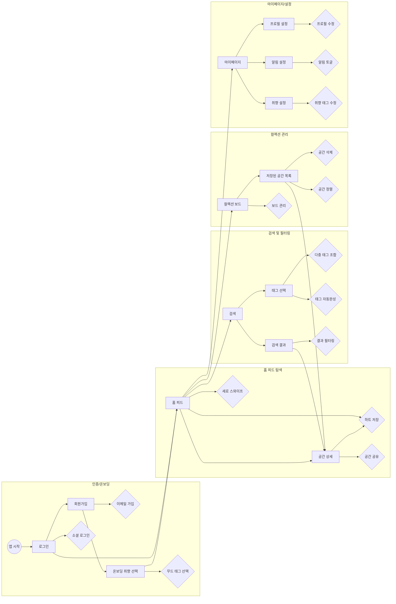

```mermaid
flowchart LR

  subgraph s1 ["인증/온보딩"]
    n1(("앱 시작"))
    n25["로그인"]
    n26["회원가입"]
    n27{"소셜 로그인"}
    n28{"이메일 가입"}
    n29["온보딩 취향 선택"]
    n30{"무드 태그 선택"}
  end

  subgraph s2 ["홈 피드 탐색"]
    n2["홈 피드"]
    n3["공간 상세"]
    n4{"세로 스와이프"}
    n5{"하트 저장"}
    n6{"공간 공유"}
  end

  subgraph s3 ["검색 및 필터링"]
    n7["검색"]
    n8["태그 선택"]
    n9["검색 결과"]
    n10{"다중 태그 조합"}
    n11{"태그 자동완성"}
    n12{"결과 필터링"}
  end

  subgraph s4 ["컬렉션 관리"]
    n13["컬렉션 보드"]
    n14["저장된 공간 목록"]
    n15{"공간 삭제"}
    n16{"공간 정렬"}
    n17{"보드 관리"}
  end

  subgraph s5 ["마이페이지/설정"]
    n18["마이페이지"]
    n19["프로필 설정"]
    n20["알림 설정"]
    n21["취향 설정"]
    n22{"프로필 수정"}
    n23{"알림 토글"}
    n24{"취향 태그 수정"}
  end

  n1 --> n25
  n25 --> n26
  n25 --> n27
  n26 --> n28
  n26 --> n29
  n29 --> n30
  n25 --> n2
  n29 --> n2
  n2 --> n3
  n2 --> n4
  n2 --> n5
  n3 --> n6
  n3 --> n5
  n2 --> n7
  n7 --> n8
  n8 --> n10
  n8 --> n11
  n7 --> n9
  n9 --> n12
  n9 --> n3
  n2 --> n13
  n13 --> n14
  n14 --> n15
  n14 --> n16
  n13 --> n17
  n14 --> n3
  n2 --> n18
  n18 --> n19
  n18 --> n20
  n18 --> n21
  n19 --> n22
  n20 --> n23
  n21 --> n24
```
