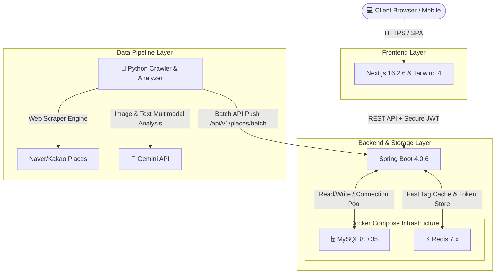
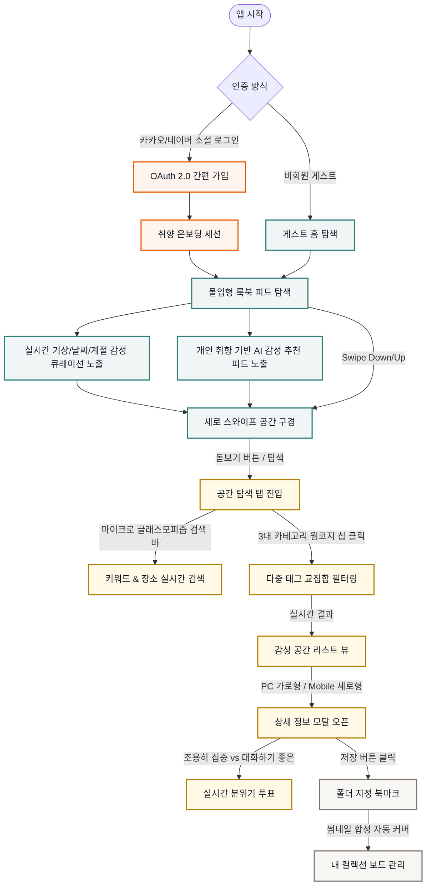

# 🌿 PickPl (픽플) - 공간을 픽하다

> **AI 기반 무드 큐레이션 공간 룩북 플랫폼**
> 
> 기존의 딱딱한 별점과 거리 중심 정보에서 벗어나, **고화질 이미지와 AI가 자동 분석한 감성 무드 태그**를 통해 나만의 취향이 담긴 공간을 직관적으로 '픽(Pick)'할 수 있는 초개인화 공간 큐레이션 서비스입니다.

<br />

<div align="center">

[](https://nextjs.org)
[](https://spring.io/projects/spring-boot)
[](https://openjdk.org)
[](https://www.mysql.com)
[](https://www.docker.com)

</div>

---

## 📖 PickPl 개요

바쁜 현대인들에게 카페나 식당, 스터디룸 등의 공간은 단순한 장소를 넘어 **'나만의 시간을 보내는 감성 영역'**입니다. 
PickPl은 사용자들이 더 이상 텍스트 리뷰와 평점을 하나하나 분석하지 않고도, 직관적인 **비주얼 룩북 피드**와 **대칭성 높은 시그니처 무드 태그**를 통해 단 0.1초 만에 감성에 녹아드는 공간을 선택할 수 있는 프리미엄 경험을 제공합니다.


### ✨ 주요 차별화 기능
1. **📱 몰입형 룩북 피드 (Swipe Curation):**
   - 핀터레스트/인스타그램 스타일의 미려한 카드 레이아웃과 프로필 구조를 가진 모바일/PC 반응형 룩북 피드.
   - 직관적이고 부드러운 스와이프 인터랙션을 통해 공간의 매력을 한눈에 제공.
2. **🎯 3대 카테고리 웜 코지 감성 필터 (Warm Cozy Filter System):**
   - **요즘 뜨는 취향 (popular)**: 피치/테라코타 웜 오렌지 테마 (`#FFF4EE` / `#E65C00`)
   - **공간의 무드 (mood)**: Cozy 세이지 그린 테마 (`#F0F6F5` / `#2E7D7A`)
   - **목적과 시설 (facility)**: 웜 뮤티드 골드 테마 (`#FFF9E6` / `#B38000`)
   - 태그 클릭 시 픽플 고유의 팔레트 소프트 글로우 효과와 입체감을 제공하는 3D 리액티브 버튼 시스템.
3. **🤖 AI 자동 무드 태깅:**
   - **Gemini API**를 결합하여 웹 크롤링된 공간 이미지와 사용자 리뷰 텍스트를 자동 파싱.
   - 단 한 번의 호출로 공간의 주요 분위기(Cozy, Modern, Minimal 등)와 핵심 장점(콘센트 많음, 반려동물 동반 등)을 감성 한 줄 요약 및 최적 태그로 자동 분류하는 최첨단 AI 파이프라인.
4. **🗂️ 사용자 정의 비주얼 컬렉션 보드:**
   - 핀터레스트 스타일의 저장 위치 지정과 썸네일 콜라주(1~4장 이미지 자동 합성 커버) 기술 탑재.
   - 무드/목적에 맞게 나만의 폴더(예: '비 오는 날 작업실', '햇살 맛집 디저트')를 만들어 간직하는 취향 아카이브.

---

## 🏗️ 시스템 아키텍처 (System Architecture)

PickPl 서비스의 고가용성과 최적의 성능, 그리고 유기적인 모노레포 통합 인프라 격리를 실현하기 위해 구성된 **Next.js & Spring Boot 기반의 컨테이너 아키텍처**입니다.



### ⚙️ 시스템 구성의 핵심 기능:
* **Frontend (Next.js / Tailwind CSS)**
  - 글로벌 CDN 배포 최적화 및 정적/동적 하이브리드 캐싱을 통한 로드 속도 단축.
  - 최신 Tailwind CSS 기반 유연하고 미려한 모던 디자인 토큰 시스템 구축.
* **Backend & DB (Docker Compose)**
  - Docker Compose 환경을 바탕으로 **Spring Boot 4.0.6**, **MySQL 8.0.35**, **Redis 7.x** 서버를 완전히 격리된 단일 네트워크 내에서 빠르고 안전하게 연속 구동.
  - Redis 메모리 캐싱 및 토큰 인증 서버 구동으로 무상태 API의 성능 최적화.
* **Data Pipeline (Python & Gemini API)**
  - 독립적으로 구성된 Python 크롤러가 포털 지도의 공간 사진과 리뷰 데이터를 수집합니다.
  - 수집된 데이터를 Gemini API로 전달해 멀티모달(이미지+텍스트) 방식으로 공간의 감성 무드 지표와 카테고리 태그 분류 연산을 처리합니다.
  - 가공 완료된 최종 데이터셋은 백엔드가 제공하는 `/api/v1/places/batch` 엔드포인트를 통해 DB에 안전하고 일괄적으로 주입(Injection)됩니다.

---

## 🔄 유저 플로우 (User Flow)



---

## 📁 프로젝트 구조 (Monorepo)

본 프로젝트는 프론트엔드와 백엔드의 상호 유기적인 로컬 실행 및 배포 자동화를 위해 최적화된 **모노레포(Monorepo)** 아키텍처로 운영됩니다.

```text
pickpl/ (Root Directory)
├── frontend/                 # Next.js 16.2.6 & Tailwind 4 프론트엔드 애플리케이션
│   ├── app/                  # App Router 기반 페이지 구성 (layout, page 등)
│   ├── components/           # 프리미엄 공통 컴포넌트 (ResponsiveApp.tsx 등)
│   ├── store/                # Zustand 기반 초경량 글로벌 상태 관리
│   └── api/                  # Axios 인터셉터 기반 REST API 클라이언트
├── backend/                  # Spring Boot 4.0.6 백엔드 API 서버 (Java 25)
│   ├── src/main/java/        # 도메인 비즈니스 로직 및 API 컨트롤러
│   │   └── com/pickpl/app/
│   │       ├── config/       # Spring Security, CORS, OAuth2 설정
│   │       ├── controller/   # API 엔드포인트 구현 (Places, Scraps 등)
│   │       ├── domain/       # JPA 엔티티 선언 (Place, Scrap, Member)
│   │       └── service/      # 무드 투표, 폴더 관리, OAuth 가입 핵심 서비스
│   └── build.gradle          # 의존성 설정 (JPA, MySQL, Redis, JWT 등)
├── docker-compose.yml        # MySQL 8.0 및 Redis 로컬 구동 컨테이너 인프라 스펙
├── Makefile                  # 로컬 통합 실행 단축 스크립트 (make up/front/back)
├── .env.example              # 로컬 및 개발 환경용 환경변수 템플릿
└── README.md                 # 본 가이드 문서
```

---

## 🚀 로컬 실행 가이드 (Getting Started)

`Makefile`을 사용하여 복잡한 환경 설정 명령어 입력 없이 즉각적으로 인프라를 실행하고 통합 개발을 시작할 수 있습니다.

### 1. 사전 준비 (Prerequisites)
* 로컬 PC에 **Docker / Docker Desktop**이 실행 중이어야 합니다.
* **Java 25 SDK** 및 **Node.js 18 이상**이 설치되어 있어야 합니다.

### 2. 환경 변수 설정
프로젝트 루트 경로에 `.env` 파일을 복사 및 생성하고 데이터베이스 접속 정보를 설정합니다.
```bash
cp .env.example .env
```
```env
# MySQL 환경변수 설정
DB_DATABASE=pickpl
DB_ROOT_PASSWORD=your_secure_password
```

### 3. 단축 명령어 실행 (Makefile 활용)

```bash
# [최초 1회] 저장소 복제 및 폴더 이동
git clone https://github.com/minari0v0/pickpl.git
cd pickpl

# 1. 로컬 인프라 (MySQL 8, Redis 7) 컨테이너 백그라운드 기동
make up

# 2. [터미널 1] Spring Boot 백엔드 애플리케이션 실행
# 포트: localhost:8080 (Swagger: http://localhost:8080/swagger-ui/index.html)
make back

# 3. [터미널 2] Next.js 프론트엔드 로컬 개발 서버 기동
# 포트: localhost:3000
make front
```

* **개발 인프라 종료 시:**
  ```bash
  make down
  ```

---

## 🔒 보안 및 편의성
* **JWT 기반 무상태(Stateless) 보안**: 
  - OAuth 2.0 성공 시 리다이렉션을 통해 액세스 토큰을 로컬에 보관하며, Axios API 호출 시 JWT Bearer 인증 헤더를 안전하게 주입합니다.
* **OpenAPI 3.0 Swagger UI**:
  - `http://localhost:8080/swagger-ui.html`을 통해 백엔드의 모든 엔드포인트(장소, 태그 검색, 즐겨찾기, 무드 투표 등)를 즉석에서 실시간 시뮬레이션 및 테스트할 수 있습니다.

---

## 📜 라이선스 (License)
This project is licensed under the MIT License.
