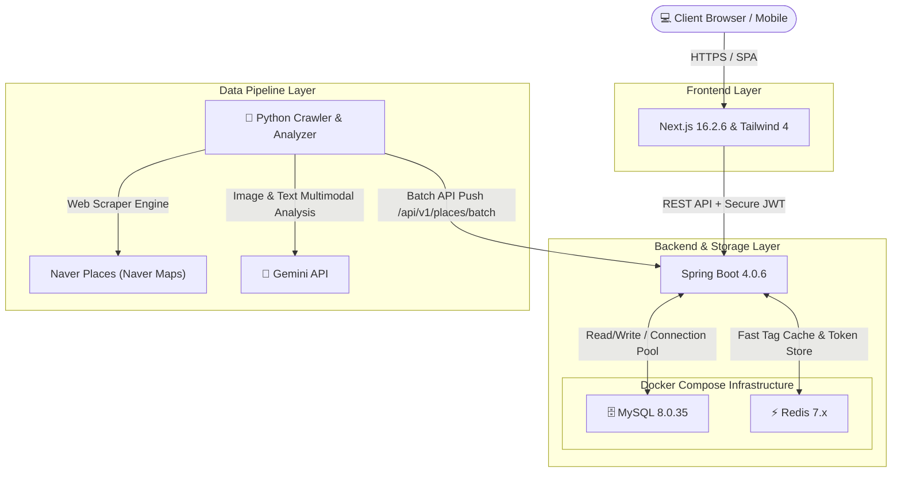
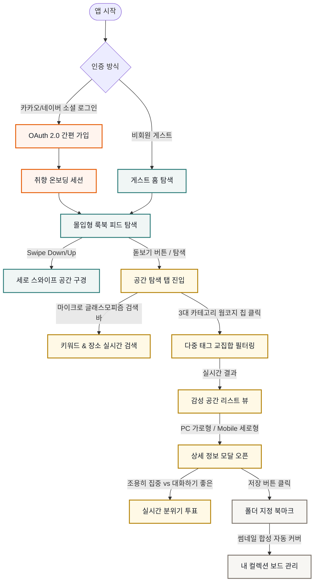

# 🌿 PickPl (픽플) - 공간을 픽하다

> **광고 가득한 긴 리뷰 대신, 사진과 요약 정보로 가보고 싶은 공간을 빠르게 찾는 서비스**

<br />

<div align="center">

[](https://nextjs.org)
[](https://spring.io/projects/spring-boot)
[](https://openjdk.org)
[](https://www.mysql.com)
[](https://www.docker.com)

</div>

---

## 📖 PickPl 개요

우리는 새로운 카페나 맛집, 작업 공간을 찾을 때 블로그와 광고가 뒤섞인 수많은 리뷰 글을 읽느라 피로를 느끼곤 해요. 

픽플(PickPl)은 사용자가 긴 리뷰를 하나하나 읽어보지 않아도, 한눈에 들어오는 **비주얼 룩북 피드**와 **AI가 핵심만 요약한 한 줄 코멘트, 무드 태그**를 통해 나의 취향에 딱 맞는 장소를 빠르고 쉽게 결정할 수 있도록 돕습니다.


### ✨ 주요 기능

1. **📱 비주얼 룩북 피드**
   - 핀터레스트처럼 미려한 카드 레이아웃과 화면 가득 차는 시각적 이미지를 지원해요. 직관적인 상하 스와이프 탐색으로 공간의 매력을 한눈에 전달합니다.
   
2. **🎯 취향 맞춤형 태그 필터**
   - 요즘 뜨는 취향, 공간의 분위기, 이용 목적과 편의 시설까지 3대 기준에 따라 태그를 체계적으로 분류했어요. 여러 태그를 조합해 지금 나에게 꼭 필요한 장소만 콕 집어 탐색할 수 있습니다.
   
3. **🤖 AI 자동 무드 태깅 & 수집 파이프라인**
   - 크롤링해 온 공간의 대표 사진과 실제 이용자 리뷰 데이터를 AI(Gemini)가 종합적으로 분석해요. 장소의 특징을 설명해 주는 트렌디한 한 줄 코멘트와 적합한 태그들을 자동으로 분류하고 적재합니다.
   
4. **🗂️ 내 취향을 모으는 컬렉션 폴더**
   - 마음에 드는 공간들을 나만의 폴더(예: '노트북하기 좋은 조용한 카페', '비 오는 날 가고 싶은 와인바')로 만들어 저장해 보세요. 폴더에 모인 이미지들을 자동으로 조합하여 멋진 콜라주 형태의 폴더 커버를 만들어 드립니다.

---

## 🛠️ 기술 스택 (Tech Stack)

| 레이어 | 핵심 기술 및 도구 | 역할 및 상세 |
| :--- | :--- | :--- |
| **Frontend** | Next.js, React, Tailwind CSS 4, Zustand, Axios, TypeScript | - 모바일 중심 반응형 룩북 피드 및 직관적인 다중 태그 탐색 UI 제공<br>- Zustand 기반 상태 관리 및 하이브리드 캐싱 최적화 |
| **Backend** | Spring Boot 4.0.6, Java 25, Spring Security, JPA, Gradle | - JWT 기반 무상태 보안 및 간편 OAuth2 소셜 로그인 구현<br>- 실시간 분위기 투표 및 컬렉션/스크랩 기능 비즈니스 API 설계 |
| **Database & Cache** | MySQL 8.0.35, Redis 7.x, Docker Compose | - Docker 환경의 다중 데이터 스토리지 구성 및 격리된 인프라 구축<br>- Redis 캐싱 기반 태그 검색 및 세션 최적화 |
| **Data Pipeline** | Python, Playwright, Gemini API, Tkinter GUI | - Playwright 엔진 기반의 공간 정보 데이터 수집 및 정합성 검증<br>- Gemini 멀티모달(이미지/텍스트) 기반 무드 분석 및 자동 태깅<br>- Tkinter 기반 수집 현황 모니터링 GUI 대시보드 구축 |

---

## 🏗️ 시스템 아키텍처 (System Architecture)

PickPl 서비스의 고가용성과 최적의 성능, 그리고 유기적인 모노레포 통합 인프라 격리를 실현하기 위해 구성된 **Next.js & Spring Boot 기반의 컨테이너 아키텍처**입니다.



### ⚙️ 시스템 구성의 핵심 기능:
* **Frontend (Next.js / Tailwind CSS)**
  - 글로벌 CDN 배포를 최적화하고 정적/동적 하이브리드 캐싱을 적용해 첫 페이지 로드 속도를 크게 줄였어요.
  - 최신 Tailwind CSS를 사용해 일관성 있고 깔끔한 디자인 시스템을 구축했습니다.
* **Backend & DB (Docker Compose)**
  - Docker Compose를 활용해 Spring Boot, MySQL, Redis 서버를 완전히 격리된 단일 네트워크에서 안전하게 구동하고 있어요.
  - Redis 메모리 캐싱과 토큰 인증을 활용해 API 성능을 한층 더 끌어올렸습니다.
* **Data Pipeline (Python & Gemini API)**
  - 독립된 **Playwright 기반 Python 수집 모듈**이 네이버 지도의 공간 사진과 리뷰 데이터를 수집해요. 오직 네이버 지도로 단일화하고 Playwright를 통한 모바일 웹 브라우저 컨텍스트 최적화로 수집 과정의 안정성을 크게 높였습니다.
  - 크롤링과 AI 분석을 2단계로 완전히 분리했어요. 덕분에 API 429 제한(Quota)이 발생해도 멈추지 않고, 이어서 수집(Resume)하고 백필(Backfill)할 수 있습니다.
  - 가공이 끝난 데이터셋은 백엔드의 `/api/v1/places/batch` API를 통해 안전하게 일괄 등록됩니다.

---

## 🔄 유저 플로우 (User Flow)



---

## 📁 프로젝트 구조

프론트엔드와 백엔드, 그리고 데이터 파이프라인이 유기적으로 연결된 **모노레포(Monorepo)** 형태로 구성되어 있어요. 각 레이어는 느슨하게 결합되어 있어 데이터 수집/가공과 서비스 제공이 완벽하게 분리되어 안정적으로 동작합니다.

### 🗺️ 전체 디렉토리 오버뷰
```text
pickpl/ (Root Directory)
├── frontend/           # Next.js 프론트엔드 웹 앱
├── backend/            # Spring Boot 백엔드 API 서버
├── data-pipeline/      # Playwright & Gemini 데이터 수집 파이프라인
├── docker-compose.yml  # MySQL & Redis 개발 환경 컨테이너 스펙
└── Makefile            # 로컬 통합 개발 실행 단축 스크립트
```

<br />

> **💡 아래의 각 레이어 영역을 클릭하면 상세 디렉토리 구조를 확인할 수 있어요!**

<details>
<summary><b>🎨 Frontend (Next.js & Tailwind CSS 4) 구조 보기</b></summary>

```text
frontend/
├── app/                  # App Router 기반 페이지 및 레이아웃
│   ├── admin/            # CMS 어드민 & 데이터 주입 패널
│   ├── login/            # 소셜 및 게스트 로그인
│   ├── oauth-signup/     # OAuth 취향 온보딩 회원가입
│   ├── auth-success/     # 소셜 로그인 성공 콜백 핸들러
│   ├── layout.tsx        # 글로벌 모바일 뷰 래퍼 레이아웃
│   └── page.tsx          # 메인 감성 룩북 피드 페이지
├── components/           # 프리미엄 반응형 UI 컴포넌트
│   ├── ui/               # 아코디언, 버튼, 스켈레톤 등 공통 하위 UI 칩
│   ├── modals/           # 공간 상세 모달 (PlaceDetailModal 등) 및 약관 모달
│   ├── views/            # 모바일 핏 스와이프 피드, 검색, 컬렉션 뷰
│   └── ResponsiveApp.tsx # 미디어 쿼리 기반 데스크탑-모바일 듀얼 레이아웃 래퍼
├── store/                # Zustand 기반 초경량 글로벌 상태 관리
└── api/                  # Axios 인터셉터 기반 REST API 클라이언트
```
</details>

<details>
<summary><b>⚙️ Backend (Spring Boot 4.0.6 & Java 25) 구조 보기</b></summary>

```text
backend/
├── src/main/java/com/pickpl/app/
│   ├── auth/         # 소셜 OAuth2 및 이메일 회원가입/인증 로직
│   ├── config/       # Spring Security, CORS, JPA 등 시스템 환경설정
│   ├── domain/       # JPA 핵심 엔티티 정의 (Place, Scrap, Member)
│   ├── init/         # 개발용 초기화 더미 데이터 주입
│   ├── place/        # 장소 정보 관리 API (Places, DB batch 주입, DTO)
│   ├── scrap/        # 개인 컬렉션/스크랩 보드 API
│   ├── security/     # JWT Token Provider 및 필터 보안 체인
│   └── vibe/         # 장소 상세 내의 실시간 혼잡도/분위기 투표 API
└── build.gradle      # 의존성 설정 (JPA, MySQL, Redis, JWT 등)
```
</details>

<details>
<summary><b>🐍 Data Pipeline (Python & Playwright & Gemini) 구조 보기</b></summary>

```text
data-pipeline/
├── scraper/              # 1단계: 네이버 플레이스 모바일 페이지 기반 데이터 수집기 (Playwright)
├── analyzer/             # 2단계: Gemini AI 구조화 감성/카테고리 분석기
├── loader/               # 3단계: 가공 데이터 백엔드 DB 벌크 로더
├── raw_data/             # 크롤링 생데이터 및 AI 분석 JSON 결과 저장소
├── main.py               # 파이프라인 통합 CLI 엔진 (Scrape & Analyze 독립 수행 가능)
├── backfill.py           # 429 쿼터 초과 대비 임시 더미데이터 사후 복구용 백필 툴
├── migrate_from_log.py   # 수집 로그 기반 searchQuery 메타데이터 정밀 동기화 툴
├── migrate_queries.py    # 수집된 데이터의 쿼리 데이터 정밀 이관 툴
├── regions.json          # 전국 행정구역 및 수집 타겟 검색 질의 리스트
├── analyzed_places.json.example  # 로컬 개발 및 테스트를 위한 데이터셋 샘플
└── requirements.txt      # 파이썬 가상환경 의존성 정의 파일
```
</details>

---

## 🚀 로컬 실행 가이드 (Getting Started)

`Makefile`을 사용하여 복잡한 환경 설정 명령어 입력 없이 즉각적으로 인프라를 실행하고 통합 개발을 시작할 수 있습니다.

### 1. 사전 준비 (Prerequisites)
* 로컬 PC에 **Docker / Docker Desktop**이 실행 중이어야 합니다.
* **Java 25 SDK** 및 **Node.js 18 이상**이 설치되어 있어야 합니다.

### 2. 환경 변수 설정
프로젝트 루트 경로에 `.env` 파일을 복사 및 생성하고 데이터베이스 접속 정보를 설정합니다.
```bash
cp .env.example .env
```
```env
# MySQL 환경변수 설정
DB_DATABASE=pickpl
DB_ROOT_PASSWORD=your_secure_password
```

### 3. 단축 명령어 실행 (Makefile 활용)

```bash
# [최초 1회] 저장소 복제 및 폴더 이동
git clone https://github.com/minari0v0/pickpl.git
cd pickpl

# 1. 로컬 인프라 (MySQL 8, Redis 7) 컨테이너 백그라운드 기동
make up

# 2. [터미널 1] Spring Boot 백엔드 애플리케이션 실행
# 포트: localhost:8080 (Swagger: http://localhost:8080/swagger-ui/index.html)
make back

# 3. [터미널 2] Next.js 프론트엔드 로컬 개발 서버 기동
# 포트: localhost:3000
make front
```

* **개발 인프라 종료 시:**
  ```bash
  make down
  ```

### 4. 최초 데이터 적재 가이드 (Data Ingestion Guide)
* **보안 및 용량 정책**으로 인해 크롤링 분석 산출물이 저장되는 `data-pipeline/raw_data/` 디렉토리는 `.gitignore`에 등록되어 있습니다.
* 처음 설치 후 로컬 화면을 테스트하려면, 아래 두 가지 방법 중 하나를 선택하여 동봉된 샘플 장소 데이터(`analyzed_places.json.example`)를 주입할 수 있습니다.

#### 방법 A. CMS 어드민 패널에서 파일 업로드 (권장)
1. 프론트엔드 기동 후 `http://localhost:3000/admin` 경로로 이동합니다.
2. 어드민 최초 기본 비밀번호 `admin`을 입력하여 로그인합니다. (로그인 후 **CMS 환경설정** 탭에서 비밀번호를 안전하게 변경할 수 있습니다.)
3. 아래의 샘플 파일을 화면 중앙의 드래그 앤 드롭 영역에 놓고, 우측 상단의 **최종 DB 주입 실행** 버튼을 클릭하면 편리하게 적재됩니다.
   * 복사할 대상: `data-pipeline/analyzed_places.json.example`

#### 방법 B. CLI 터미널 명령어로 주입
1. 샘플 JSON 파일을 아래 경로로 복사합니다:
   * 복사 경로: `data-pipeline/analyzed_places.json.example` ➡️ `data-pipeline/raw_data/analyzed_places.json`
2. 백엔드 서버가 기동 중인 상태에서 파일명을 지정하여 데이터 주입 명령을 실행합니다:
   ```bash
   make pipe-load FILE=analyzed_places.json
   ```

---

## 🔒 보안 및 편의성
* **JWT 기반 무상태(Stateless) 보안**: 
  - OAuth 2.0 로그인이 끝나면 리다이렉션으로 전달된 액세스 토큰을 안전하게 보관해요. API를 호출할 때는 JWT Bearer 인증 헤더가 자동으로 주입되도록 설계했습니다.
* **OpenAPI 3.0 Swagger UI**:
  - Swagger 문서 페이지(`http://localhost:8080/swagger-ui.html`)에서 백엔드가 제공하는 모든 API(장소 탐색, 태그 검색, 즐겨찾기, 실시간 분위기 투표 등)를 즉석에서 편리하게 테스트해 볼 수 있어요.

---

## 📜 라이선스 (License)
This project is licensed under the MIT License.
