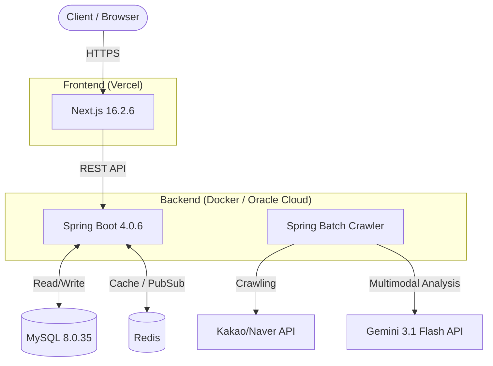
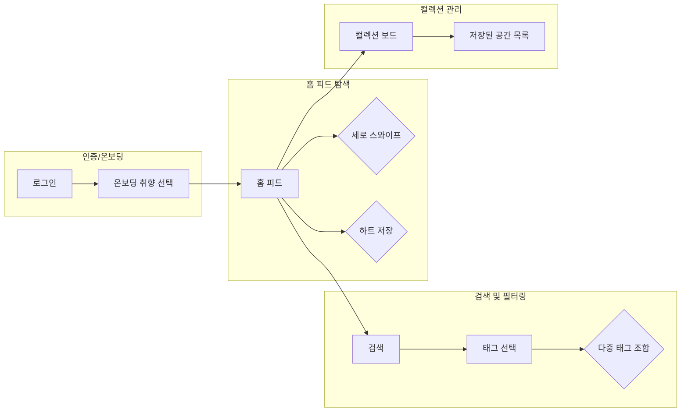

# 🌿 PickPl - 공간을 쇼핑하다
> **AI 기반 무드 큐레이션 공간 플랫폼**


## 📖 프로젝트 개요
기존 지도 앱의 거리와 별점 위주의 정보 제공 방식은 '공간의 무드와 취향'을 직관적으로 파악하기 어렵다는 한계가 있습니다.

**PickPl 3.0**은 텍스트 리뷰를 과감히 버리고, **고화질 사진과 AI가 자동 생성한 무드 태그**를 통해 사용자가 공간을 직관적으로 '쇼핑'할 수 있도록 돕는 큐레이션 플랫폼입니다.

### ✨ 핵심 기능
- **📱 몰입형 룩북 피드:** 인스타그램 릴스/틱톡처럼 세로로 스와이프하며 고화질 공간 사진 탐색
- **🎯 초정밀 취향 필터링:** `[#비오는날] + [#플랜테리어] + [#콘센트석]` 등 다중 태그 조합으로 0.1초 만에 맞춤 공간 검색 (Redis 활용)
- **🤖 AI 자동 태깅 파이프라인:** Gemini 3.1 Flash API를 활용하여 이미지와 리뷰 텍스트를 분석, 자동으로 무드/시설 태그 생성
- **🗂️ 개인 컬렉션 보드:** 마음에 드는 공간을 핀터레스트 스타일로 저장하고 관리

---

## 🏗️ 시스템 아키텍처 (System Architecture)



## 🔄 유저 플로우 (User Flow)



---

## 📁 프로젝트 구조 (Monorepo)
이 프로젝트는 프론트엔드와 백엔드의 효율적인 통합 관리 및 배포를 위해 **모노레포(Monorepo)** 구조로 구성되었습니다.

```text
pickpl/
├── frontend/           # Next.js 16 프론트엔드 애플리케이션 (Vercel 배포)
├── backend/            # Spring Boot 4 백엔드 API 서버
├── docker-compose.yml  # MySQL 8.0.35 및 Redis 로컬 실행 설정
├── Makefile            # 로컬 개발 생산성 향상을 위한 단축 명령어 스크립트
└── README.md
```

---

## 🚀 시작하기 (Getting Started)

### 1. 환경 변수 세팅
프로젝트 최상단 경로에 `.env` 파일을 생성하고 아래 환경변수를 설정 (`.env.example` 참고)
```env
DB_DATABASE=pickpl
DB_ROOT_PASSWORD=your_password
```

### 2. 프로젝트 실행 (Makefile 활용)
로컬 개발 환경에서는 `Makefile`을 사용하여 명령어 타이핑을 최소화

```bash
# 1. 의존성 다운로드 (최초 1회)
git clone https://github.com/minari0v0/pickpl.git
cd pickpl

# 2. 로컬 인프라(MySQL, Redis) 백그라운드 실행
make up

# 3. [터미널 1] 백엔드 서버 실행 (localhost:8080)
make back

# 4. [터미널 2] 프론트엔드 서버 실행 (localhost:3000)
make front
```

> **Note:** 인프라 컨테이너를 종료하려면 `make down` 명령어를 사용하세요.

---

## 📜 라이선스
This project is licensed under the MIT License.
