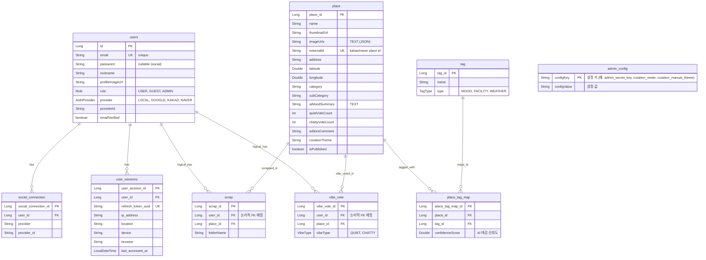

# 🌿 PickPl Backend Service

픽플(PickPl) 플랫폼의 핵심 감성 엔진과 데이터 처리를 담당하는 **Spring Boot 기반 백엔드 애플리케이션**입니다.  
사용자의 감성을 분석하고, 맥락에 맞는 장소를 지능적으로 필터링하여 매끄러운 공간 탐색 경험을 제공합니다.

---

## 📊 데이터베이스 ERD (Entity Relationship Diagram)

픽플의 핵심 도메인 모델(장소, 태그, 유저 세션, 스크랩, 분위기 투표 등) 구조와 테이블 간 릴레이션을 시각화한 ERD입니다.  
`Place`와 `Tag`는 N:M 관계의 유연성을 위해 `PlaceTagMap` 중간 매핑 테이블을 거치며, `Scrap` 및 `VibeVote`는 성능 격리 및 추후 MSA 확장을 대비해 논리적 FK 관계로 설계되었습니다.



---

## 🚀 기술 스택 & 개발 환경

| 분류 | 기술 이름 | 버전 / 상세 |
| :--- | :--- | :--- |
| **Language** | Java | JDK 25 |
| **Framework** | Spring Boot | 4.0.6 |
| **Security** | Spring Security / OAuth2 Client / JJWT | 소셜 및 자체 로그인, 다중 세션 관리 |
| **Database** | MySQL | 데이터 영속성 관리 |
| **Cache & Session** | Redis | 1:N Refresh Token 및 메일 인증 세션 캐싱 |
| **API Document** | Springdoc OpenAPI (Swagger UI) | v2.8.8 |
| **Build Tool** | Gradle | 의존성 및 빌드 관리 |

---

## 🛠️ 핵심 기술 및 알고리즘 최적화 명세

### 1. 다중 태그 교집합(Intersection) 검색 및 Page countQuery 최적화
> [!IMPORTANT]
> **성능 튜닝 배경**  
> 사용자가 여러 개의 무드/시설 태그를 선택하여 필터링할 때, 지정한 **모든** 태그를 동시에 만족하는 장소만 교집합(AND)으로 조회해야 합니다.  
> Spring Data JPA의 기본 Pageable countQuery 생성기는 `GROUP BY`와 `HAVING` 절이 포함될 때 정상적인 count 집계를 하지 못하고 잘못된 `totalElements`를 반환하거나 불필요한 Full Scan을 유발하는 치명적인 성능 버그가 있습니다.

* **기술적 해결**:  
  JPA Join 쿼리 하단에 `GROUP BY p.id`와 `HAVING COUNT(DISTINCT t.name) = :tagCount` 조건을 부여하고, **countQuery를 서브쿼리(`IN (SELECT ... GROUP BY ... HAVING ...)`)로 명시적으로 분리**하여 DB 과부하를 예방하고 정확한 페이징을 구현했습니다.

* **핵심 코드 ([PlaceRepository.java](file:///c:/Users/Silok/Downloads/myProject/pickpl/backend/src/main/java/com/pickpl/app/domain/place/PlaceRepository.java))**:
```java
@Query(value = """
        SELECT p FROM Place p
        JOIN p.placeTagMaps ptm
        JOIN ptm.tag t
        WHERE t.name IN :tagNames AND p.isPublished = true
        GROUP BY p.id
        HAVING COUNT(DISTINCT t.name) = :tagCount
        """,
        countQuery = """
        SELECT COUNT(p) FROM Place p
        WHERE p.id IN (
            SELECT ptm.place.id FROM PlaceTagMap ptm
            JOIN ptm.tag t
            WHERE t.name IN :tagNames AND ptm.place.isPublished = true
            GROUP BY ptm.place.id
            HAVING COUNT(DISTINCT t.name) = :tagCount
        )
        """)
Page<Place> findPlacesMatchingAllTags(
        @Param("tagNames") List<String> tagNames,
        @Param("tagCount") long tagCount,
        Pageable pageable);
```

---

### 2. 1:N Refresh Token 다중 기기 세션 관리 (Redis & RDB)
> [!TIP]
> **비즈니스 가치**  
> 모바일 앱, 웹 브라우저 등 여러 디바이스에서 동시에 서비스를 이용할 수 있도록 지원하며, 마이페이지에서 로그인된 활성 기기 세션(OS, 브라우저, 접속 리전)을 모니터링하고 개별적으로 원격 로그아웃할 수 있는 보안 아키텍처를 구성했습니다.

* **아키텍처 설계**:
  - 기존 1:1 토큰 매핑 구조(`RT:userId` -> `token`)를 **`RT:userId:tokenUuid` 형태의 1:N Redis 구조**로 개선했습니다.
  - 로그인 시 HTTP `User-Agent` 문자열을 정교하게 분석하여 디바이스 OS와 브라우저를 파싱하고 RDB `UserSession`에 기록합니다.
  - 사용자가 특정 기기에서 로그아웃하거나 원격으로 세션을 종료하면, 해당 `tokenUuid`에 해당하는 Redis 키를 즉각 제거(`Blacklist` 방식 대신 TTL 만료 방식 적용)하여 보안성과 처리 속도를 동시에 챙겼습니다.

* **핵심 코드 ([AuthService.java](file:///c:/Users/Silok/Downloads/myProject/pickpl/backend/src/main/java/com/pickpl/app/auth/service/AuthService.java))**:
```java
// Refresh Token을 Redis에 저장 (다중 세션: RT:userId:token)
redisTemplate.opsForValue().set(
        "RT:" + user.getId() + ":" + refreshToken,
        refreshToken,
        14, // 14일 만료
        TimeUnit.DAYS
);

// 원격 기기 로그아웃 처리
public void removeSession(String userId, Long sessionId) {
    UserSession session = userSessionRepository.findById(sessionId)
            .orElseThrow(() -> new IllegalArgumentException("존재하지 않는 세션입니다."));
            
    // Redis 세션 즉시 만료 및 DB 제거
    redisTemplate.delete("RT:" + userId + ":" + session.getRefreshTokenUuid());
    userSessionRepository.delete(session);
}
```

---

### 3. 하버사인(Haversine) 공식을 활용한 실시간 위치 거리 계산
> [!NOTE]
> 사용자가 선택한 기준 좌표(예: 특정 지하철역) 또는 디바이스 GPS 좌표를 기반으로, 플랫폼 내 등록된 공간 정보들과의 실제 직선 거리를 실시간으로 반환합니다.

* **알고리즘 구현**:
  - 지구 곡률을 반영한 수학적 공식인 **하버사인 공식(Haversine Formula)**을 적용하여 오차율을 최소화했습니다.
  - **UX 최적화**: 미터(m) 단위 결과를 그대로 노출하지 않고, `1,000m` 미만은 미터 정수형(예: `350m`), `1km` 이상은 소수점 첫째 자리의 킬로미터(예: `1.2km`)로 가독성 있게 자동 포팅하여 API 응답(DTO)을 반환합니다.

* **핵심 코드 ([PlaceService.java](file:///c:/Users/Silok/Downloads/myProject/pickpl/backend/src/main/java/com/pickpl/app/place/service/PlaceService.java))**:
```java
private double calculateDistance(double lat1, double lon1, double lat2, double lon2) {
    double R = 6371000; // 지구 반지름 (m)
    double dLat = Math.toRadians(lat2 - lat1);
    double dLon = Math.toRadians(lon2 - lon1);
    double a = Math.sin(dLat / 2) * Math.sin(dLat / 2) +
               Math.cos(Math.toRadians(lat1)) * Math.cos(Math.toRadians(lat2)) *
               Math.sin(dLon / 2) * Math.sin(dLon / 2);
    double c = 2 * Math.atan2(Math.sqrt(a), Math.sqrt(1 - a));
    return R * c;
}

private String formatDistance(Double userLat, Double userLon, Double placeLat, Double placeLon) {
    if (userLat == null || userLon == null || placeLat == null || placeLon == null) {
        return null;
    }
    double distanceInMeters = calculateDistance(userLat, userLon, placeLat, placeLon);
    if (distanceInMeters < 1000) {
        return String.format("%dm", Math.round(distanceInMeters));
    } else {
        return String.format("%.1fkm", distanceInMeters / 1000.0);
    }
}
```

---

### 4. 실시간 날씨 및 계절 감성 큐레이션 판정 알고리즘
- **비즈니스 목적**: Open-Meteo 기상 관측 Open API의 실시간 강수량, 적설량, 운량 및 현재 날짜(월) 정보를 조회하여 감성 룩북 테마에 부합하는 장소 리스트를 우선순위 노출합니다.
- **알고리즘 우선순위 판정 매트릭스**:
  1. 기상 악화(눈/비) 발생 시 ➡️ `SNOWY`(눈오는날) / `RAINY`(비오는날) 테마 트리거
  2. 기상 맑음 시 ➡️ `CLEAR`(맑은날가기좋은) / `TERRACE`(야외테라스) 테마 트리거
  3. 계절 주기 반영 ➡️ 월별 기준에 따라 가을(`단풍구경`), 겨울(`겨울온천여행`), 여름(`여름휴가`) 큐레이션 카드를 홈 메인 탭에 자동 주입

---

### 5. 취향 온보딩 및 유튜브식 2단계(Retrieval & Ranking) 개인화 추천 엔진
> [!TIP]
> **초개인화 추천 시스템 설계**  
> 사용자가 홈 화면(발견 탭)에 들어오자마자 마주하는 메인 세로 공간 피드 자체를 개개인의 행동 양식에 맞춰 유튜브 홈화면처럼 초개인화 정렬하여 제공합니다. 이를 위해 서버 부하를 완벽히 격리하는 **2단계 랭킹 파이프라인**을 구축했습니다.

* **동적 취향 가중치 모델링 (Vibe Vector)**:
  - 사용자의 행동 이력 및 설정 정보를 누적하여 태그별 관심도 점수를 계산합니다.
    - **가입 온보딩 관심 태그** 설정 시 ➡️ 태그당 `+5.0` (취향 Cold Start 방어)
    - **공간 스크랩 (북마크)** ➡️ 해당 공간 태그당 `+4.0`
    - **공간 분위기 투표** ➡️ 해당 공간 태그당 `+2.0`
    - **공간 상세페이지 단순 조회 (Click)** ➡️ 해당 공간 태그당 `+1.0`
  - 위 점수들의 총합 맵(Map)인 **사용자 취향 벡터**를 구성하고, DB 부하를 예방하기 위해 **Redis 인메모리 캐시 (Key: `user:vibe-vector:{userId}`, TTL 1시간)**에 적재하여 조회 성능을 극대화(응답 속도 20~30ms 보장)합니다.

* **2단계 추천 파이프라인 알고리즘**:
  1. **1단계: Retrieval (후보군 고속 추출 - 5ms)**:
     - 사용자 관심 상위 3개 태그가 인덱싱 쿼리 처리된 장소 100건과, 플랫폼 전체 최신 인기 장소 50건을 머지 및 중복 제거하여 총 150여 건의 **후보 풀(Candidate Pool)**을 획득합니다.
  2. **2단계: Ranking (메모리 정렬 및 지수 시간 감쇄 - 0.5ms)**:
     - JVM 메모리 상에서 후보군 장소들의 태그 세트와 유저 취향 가중치 맵의 교집합 내적 점수($MatchScore$)를 계산합니다.
     - 오래전에 등록된 매장이 피드를 영구 독점하는 현상을 방어하기 위해 경과일수($days$)에 대한 **지수적 시간 감쇄 공식($TimeDecay = e^{-0.05 \cdot days}$)**을 곱해 최종 정렬 스코어를 계산하고 상위 12개 장소를 페이징 노출합니다.
  3. **3단계: Fallback (게스트 및 스킵 회원)**:
     - 온보딩을 건너뛰었거나 로그인하지 않은 비회원에게는 전체 최신 인기 공간 목록으로 매끄럽게 폴백하여 렌더링합니다.

---

## ⚙️ 백엔드 설정 & 구동 방법

### 1. 환경 변수 구성 (.env)
백엔드 서버 구동을 위해 프로젝트 루트(`../.env`)에 위치한 다음 환경 변수들이 매핑되어야 합니다.
```properties
# 데이터베이스 & 캐시 설정
SPRING_DATASOURCE_URL=jdbc:mysql://localhost:3306/pickpl?useSSL=false&allowPublicKeyRetrieval=true&serverTimezone=Asia/Seoul
SPRING_DATASOURCE_USERNAME=root
SPRING_DATASOURCE_PASSWORD=your_password
SPRING_REDIS_HOST=127.0.0.1
SPRING_REDIS_PORT=6379

# 보안 및 토큰 서명 키
JWT_SECRET_KEY=your_super_jwt_secret_key_string_longer_than_256bit
ADMIN_SECRET_KEY=your_internal_data_pipeline_token_key

# OAuth2 소셜 로그인 설정
SPRING_SECURITY_OAUTH2_CLIENT_REGISTRATION_GOOGLE_CLIENT_ID=your_google_client_id
SPRING_SECURITY_OAUTH2_CLIENT_REGISTRATION_GOOGLE_CLIENT_SECRET=your_google_client_secret
# 카카오 / 네이버 등 동일 구조 설정
```

### 2. 개발 서버 실행
Gradle Wrapper를 사용하여 Spring Boot 웹 애플리케이션을 구동합니다.
```bash
# Windows 환경
cd backend
.\gradlew.bat bootRun

# Unix/macOS 환경
cd backend
./gradlew bootRun
```

### 3. Swagger API 문서 (Springdoc OpenAPI)
애플리케이션이 구동되면 브라우저를 통해 실시간으로 API 인터페이스를 명세화하고, 각 엔드포인트를 수동 테스트할 수 있는 **Swagger UI**가 활성화됩니다.

* **Swagger UI 접속 주소**: [http://localhost:8080/swagger-ui/index.html](http://localhost:8080/swagger-ui/index.html)
* **OpenAPI Specs JSON**: [http://localhost:8080/v3/api-docs](http://localhost:8080/v3/api-docs)

> [!NOTE]
> `PlaceController` 내 `getPlaces` (공간 다중 검색) 및 `getPlace` (공간 상세 정보) API는 위경도와 키워드 필터링을 원활하게 테스트할 수 있도록 파라미터별 세부 `@Parameter` 어노테이션 명세를 완벽히 갖추고 있습니다.
