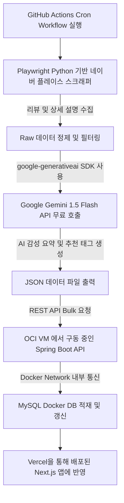

# 픽플(PickPl) 100% 무료 티어 기반 크롤링 및 AI 공간 정보 요약 파이프라인 계획서

이 계획서는 **개인 프로젝트인 PickPl**의 운영 비용을 **0원(무료)**으로 유지하면서도, 고성능의 크롤링 및 AI 큐레이션 요약 파이프라인을 구축하는 것을 목표로 합니다. 프론트엔드 호스팅, 백엔드 서버, 데이터베이스, AI API까지 모두 업계 최고 수준의 **무료 플랜(Free Tier)**을 유기적으로 결합하여 상용 서비스급 안정성을 낼 수 있도록 아키텍처를 설계합니다.

---

## 1. 무료 인프라 및 AI 스택 구성 (100% Free Stack)

| 인프라 구분 | 도입 무료 서비스 (Free Tier) | 핵심 스펙 및 용도 | 비용 |
| :--- | :--- | :--- | :--- |
| **Frontend** | **Vercel Hobby Tier** | Next.js 프론트엔드 배포 및 글로벌 Edge 캐싱 CDN 연동 | **0원** |
| **Backend** | **Oracle Cloud (OCI) Ampere VM** | ARM Ampere A1 Compute VM (최대 4 OCPUs, 24GB RAM) 또는 AMD VM. Spring Boot 애플리케이션 가동 | **0원** (평생 무료) |
| **Database** | **MySQL on Docker (OCI VM)** | Oracle Free Tier VM 내부 Docker 컨테이너로 MySQL 구동. Volume 마운트로 데이터 영속화 | **0원** |
| **AI LLM API** | **Google Gemini 1.5 Flash API** | 무료 티어 (15 RPM / 1,500 RPD / 100만 TPM 제공). 리뷰 요약 및 태그 분류 | **0원** |
| **Pipeline Runner** | **GitHub Actions / Local Scraper** | 월 2,000분 무료 Runner를 사용하여 주기적(Cron) 크롤링 & AI 처리 후 백엔드로 전송 | **0원** |

---

## 2. 크롤링 및 AI 요약 아키텍처 (Data Pipeline Flow)



### 2.1. Google Gemini 1.5 Flash API 프롬프트 디자인
Gemini 1.5 Flash는 무료 티어 기준 분당 15회 호출이 가능하며, 대용량 컨텍스트 처리에 적합합니다. JSON Mode 또는 구조화된 출력(Structured Output)을 활용하여 파싱 에러를 예방합니다.

```json
{
  "contents": [
    {
      "parts": [
        {
          "text": "당신은 트렌디한 공간 큐레이터입니다. 제시된 블로그/방문자 리뷰 [리뷰 목록]을 종합 분석하여 아래 JSON 스펙으로 출력하세요.\n\nJSON 스펙:\n{\n  \"aiMoodSummary\": \"장소의 전반적인 분위기와 추천 대상을 담은 1-2줄 핵심 요약글 (최대 100자)\",\n  \"tags\": [\"추천 태그 풀에서 적합한 태그 3~5개\"]\n}\n\n추천 태그 풀:\n[대형카페, 노트북하기좋은, 햇살맛집, 디저트맛집, 뷰맛집, 데이트코스, 코지한, 따뜻한우드톤, 조용한, 콘센트석, 단체석]"
        }
      ]
    }
  ]
}
```

---

## 3. 크롤링 파이프라인 단계별 무료 최적화 구현 상세

### 🚀 [Scraper Runner] GitHub Actions 기반 서버리스 파이프라인
* **비용 절감 핵심**: OCI 무료 티어 인스턴스의 CPU 및 네트워크 대역폭 부하를 최소화하고 IP 차단(Captchas)을 예방하기 위해, 크롤러를 OCI 서버가 아닌 **GitHub Actions Runner**에서 실행합니다.
* **동작 상세**:
  1. `Playwright (Python)` 스크래퍼가 매월 정해진 스케줄러(GitHub Actions Cron)에 의해 동작합니다.
  2. 수집된 텍스트 데이터를 즉시 **Gemini API**로 보내 분석합니다. (Gemini SDK 내 Rate Limit 딜레이 약 4초 추가하여 무료 티어 15 RPM 한도 준수)
  3. AI 가공 완료된 JSON 페이로드를 최종적으로 OCI VM에서 실시간 가동 중인 Spring Boot 백엔드 `POST /api/v1/admin/places/batch-update` API로 쏘아 저장합니다.

### 🐳 [Backend & DB] Oracle Cloud Free Tier + Docker Compose
* **리소스 구성**:
  * OCI의 `Ubuntu ARM` 인스턴스에 Docker와 Docker Compose를 설치합니다.
  * `docker-compose.yml`을 작성하여 Spring Boot 애플리케이션 컨테이너와 MySQL 데이터베이스 컨테이너를 통합 관리합니다.
* **Volume 마운트를 통한 데이터 보존**:
  * OCI VM의 로컬 경로와 Docker MySQL 컨테이너 내부 `/var/lib/mysql` 경로를 바인딩하여, 컨테이너가 재시작되어도 수집 데이터가 날아가지 않도록 보장합니다.

### 🌐 [Client] Vercel Hobby Tier 배포 및 캐싱 최적화
* **서버 부하 감소**: Vercel의 Serverless Functions 실행 한계(무료 플랜 10초 타임아웃) 및 OCI 백엔드 커넥션 부하를 해결하기 위해, Next.js 프론트엔드는 **SWR(Client-side data fetching)**과 **Edge Caching**을 적극 활용합니다.
* **동적 렌더링 최적화**: API 조회 빈도를 낮추기 위해 변하지 않는 장소 데이터는 Next.js 빌드 시 정적 페이지(Static Generation)로 프리렌더링하고, 실시간 무드 투표 정보만 클라이언트에서 가볍게 리패칭합니다.

---

## 4. 무료 티어 한계 극복을 위한 필수 점검 사항 (Gotchas)

1. **Oracle Cloud 회수 정책 대응 (Keep-Alive)**:
   * Oracle Free Tier는 오랫동안 CPU/메모리 사용량이 10% 이하로 떨어지면 유휴 리소스로 판단하고 인스턴스를 회수(정지)할 수 있습니다.
   * **대응책**: 백엔드 스프링 서버가 상시 가동 중이므로 기본 CPU 점유가 유지되지만, 안전을 위해 매주 가벼운 스케줄링 태스크(덤프 연산 또는 핑 테스트)를 띄워 강제로 소량의 리소스를 사용하게 조치합니다.
2. **백업 자동화 (Cron Job to GitHub / Google Drive)**:
   * 무료 인프라는 물리적 디스크 장애나 계정 이슈로 언제든 중단될 수 있습니다.
   * **대응책**: `mysqldump` 명령어를 이용해 매일 새벽 데이터베이스를 백업하고, 이를 무료 개인 비공개 GitHub 저장소나 Google Drive API를 통해 주기적으로 업로드하는 백업 스크립트를 OCI VM에 스케줄링해 둡니다.
3. **Gemini API 무료 티어 할당량(Rate Limit) 제어**:
   * Gemini 1.5 Flash 무료 API는 분당 15회 호출 제한이 걸려 있습니다.
   * **대응책**: 크롤러 스크립트 작성 시, API 호출 사이에 `time.sleep(4.5)` 이상을 의도적으로 부여해 동시 요청 병목으로 인한 API 실패(HTTP 429)를 미연에 방지합니다.

---

본 계획을 통해 **완벽한 제로 비용(0원)**으로 최고의 안정성을 보장하는 데이터 큐레이션 파이프라인과 인프라 배포를 완수하겠습니다.
