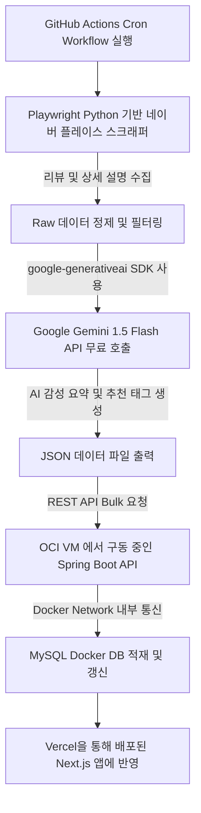

# 픽플(PickPl) 100% 무료 티어 기반 크롤링 및 AI 공간 정보 요약 파이프라인 계획서

이 계획서는 **개인 프로젝트인 PickPl**의 운영 비용을 **0원(무료)**으로 유지하면서도, 고성능의 크롤링 및 AI 큐레이션 요약 파이프라인을 구축하는 것을 목표로 합니다. 프론트엔드 호스팅, 백엔드 서버, 데이터베이스, AI API까지 모두 업계 최고 수준의 **무료 플랜(Free Tier)**을 유기적으로 결합하여 상용 서비스급 안정성을 낼 수 있도록 아키텍처를 설계합니다.

---

## 1. 무료 인프라 및 AI 스택 구성 (100% Free Stack)

| 인프라 구분 | 도입 무료 서비스 (Free Tier) | 핵심 스펙 및 용도 | 비용 |
| :--- | :--- | :--- | :--- |
| **Frontend** | **Vercel Hobby Tier** | Next.js 프론트엔드 배포 및 글로벌 Edge 캐싱 CDN 연동 | **0원** |
| **Backend** | **Oracle Cloud (OCI) Ampere VM** | ARM Ampere A1 Compute VM (최대 4 OCPUs, 24GB RAM) 또는 AMD VM. Spring Boot 애플리케이션 가동 | **0원** (평생 무료) |
| **Database** | **MySQL on Docker (OCI VM)** | Oracle Free Tier VM 내부 Docker 컨테이너로 MySQL 구동. Volume 마운트로 데이터 영속화 | **0원** |
| **AI LLM API** | **Google Gemini 1.5 Flash API** | 무료 티어 (15 RPM / 1,500 RPD / 100만 TPM 제공). 리뷰 요약 및 태그 분류 | **0원** |
| **Pipeline Runner** | **GitHub Actions / Local Scraper** | 월 2,000분 무료 Runner를 사용하여 주기적(Cron) 크롤링 & AI 처리 후 백엔드로 전송 | **0원** |

---

## 2. 크롤링 및 AI 요약 아키텍처 (Data Pipeline Flow)



### 2.1. Google Gemini 1.5 Flash API 프롬프트 디자인
Gemini 1.5 Flash는 무료 티어 기준 분당 15회 호출이 가능하며, 대용량 컨텍스트 처리에 적합합니다. JSON Mode 또는 구조화된 출력(Structured Output)을 활용하여 파싱 에러를 예방합니다.

```json
{
  "contents": [
    {
      "parts": [
        {
          "text": "당신은 트렌디한 공간 큐레이터입니다. 제시된 블로그/방문자 리뷰 [리뷰 목록]을 종합 분석하여 아래 JSON 스펙으로 출력하세요.\n\nJSON 스펙:\n{\n  \"aiMoodSummary\": \"장소의 전반적인 분위기와 추천 대상을 담은 1-2줄 핵심 요약글 (최대 100자)\",\n  \"tags\": [\"추천 태그 풀에서 적합한 태그 3~5개\"]\n}\n\n추천 태그 풀:\n[대형카페, 노트북하기좋은, 햇살맛집, 디저트맛집, 뷰맛집, 데이트코스, 코지한, 따뜻한우드톤, 조용한, 콘센트석, 단체석]"
        }
      ]
    }
  ]
}
```

### 2.2. 최종 적재용 공간 메타데이터 스펙 (Place Metadata Schema)

파이프라인이 수집, 분석을 끝마치고 백엔드 API(`POST /api/v1/internal/places/batch`)로 주입하기 직전의 최종 장소 객체(Metadata) 규격과 예시입니다.

```json
{
  "name": "메이크제로존",
  "address": "서울 마포구 망원로 49 망원빌딩 지하1층",
  "externalId": "naver_place_1457717315",
  "latitude": 37.5500,
  "longitude": 126.9200,
  "category": "카페,디저트",
  "thumbnailUrl": "https://search.pstatic.net/common/?src=https%3A%2F%2Fldb-phinf.pstatic.net%2F...",
  "imageUrls": "https://search.pstatic.net/common/?src=https%3A%2F%2Fldb-phinf.pstatic.net%2F...",
  "reviews": [
    "망원동에 위치한 보물같은 장소인 카페+빈티지샵 복합공간 이었습니다. 지하라서 매우 조용하고..."
  ],
  "aiMoodSummary": "망원동 지하에 숨겨진 보물! 빈티지샵과 카페의 조화가 힙하고, 아늑한 분위기에서 맛있는 커피와 그릭요거트를 즐길 수 있는 공간.",
  "tags": [
    "코지한",
    "힙한분위기",
    "따뜻한우드톤",
    "조용한"
  ],
  "features": [
    {
      "title": "주차 가능",
      "desc": "건물 자체 주차장 지원 (가게 문의)"
    },
    {
      "title": "콘센트 많음",
      "desc": "작업용 좌석이 많고 충전 콘센트가 다수 배치되어 있습니다."
    }
  ]
}
```

#### 📋 필드별 메타데이터 속성 정의

| 필드명 | 데이터 타입 | 설명 및 정제 기준 |
| :--- | :--- | :--- |
| **`name`** | `String` | 장소의 한글 상호명 (예: `메이크제로존`) |
| **`address`** | `String` | 도로명 또는 지번 상세 주소 (예: `서울 마포구 망원로 49 망원빌딩 지하1층`) |
| **`externalId`** | `String` | 중복 주입 방지를 위한 고유 ID. `포털접두사_고유번호` 조합 (예: `naver_place_1457717315`) |
| **`latitude`** | `Double` | 하버사인(Haversine) 실시간 GPS 거리 연산용 위도 데이터 (예: `37.5500`) |
| **`longitude`** | `Double` | 하버사인(Haversine) 실시간 GPS 거리 연산용 경도 데이터 (예: `126.9200`) |
| **`category`** | `String` | 크롤러가 상세 페이지에서 웹 파싱한 실제 업종 분류 (예: `카페,디저트`, `술집`, `이자카야`) |
| **`thumbnailUrl`** | `String` | 메인 피드 및 홈 카드 리스트에서 노출될 대표 썸네일 이미지 CDN URL |
| **`imageUrls`** | `String` | 상세 모달 내 상단 갤러리에 들어갈 다중 이미지 주소 (쉼표 `,` 또는 단일 문자열 형태) |
| **`reviews`** | `List<String>` | 메타데이터(방문일, 영수증 문구 등) 필터링이 완료된 감성 텍스트 리뷰 목록 (최대 5개 제한) |
| **`aiMoodSummary`**| `String` | Gemini API가 전체 리뷰와 이미지를 분석해 정제 도출한 트렌디한 1~2줄 요약문 (최대 100자) |
| **`tags`** | `List<String>` | 추천 감성 태그 풀에서 Gemini가 적합하게 골라낸 2~5개의 태그 리스트 |
| **`features`** | `List<Object>` | **[신규]** 공식 편의시설 정보 및 AI 리뷰 스캔을 기반으로 추출된 2~3가지 장소별 물리/편의 특징 리스트 (각 객체는 `title`, `desc`를 가짐) |

---

## 3. 크롤링 파이프라인 단계별 무료 최적화 구현 상세

### 🚀 [Scraper Runner] GitHub Actions 기반 서버리스 파이프라인
* **비용 절감 핵심**: OCI 무료 티어 인스턴스의 CPU 및 네트워크 대역폭 부하를 최소화하고 IP 차단(Captchas)을 예방하기 위해, 크롤러를 OCI 서버가 아닌 **GitHub Actions Runner**에서 실행합니다.
* **동작 상세**:
  1. `Playwright (Python)` 스크래퍼가 매월 정해진 스케줄러(GitHub Actions Cron)에 의해 동작합니다.
  2. 수집된 텍스트 데이터를 즉시 **Gemini API**로 보내 분석합니다. (Gemini SDK 내 Rate Limit 딜레이 약 4초 추가하여 무료 티어 15 RPM 한도 준수)
  3. AI 가공 완료된 JSON 페이로드를 최종적으로 OCI VM에서 실시간 가동 중인 Spring Boot 백엔드 `POST /api/v1/admin/places/batch-update` API로 쏘아 저장합니다.

### 🐳 [Backend & DB] Oracle Cloud Free Tier + Docker Compose
* **리소스 구성**:
  * OCI의 `Ubuntu ARM` 인스턴스에 Docker와 Docker Compose를 설치합니다.
  * `docker-compose.yml`을 작성하여 Spring Boot 애플리케이션 컨테이너와 MySQL 데이터베이스 컨테이너를 통합 관리합니다.
* **Volume 마운트를 통한 데이터 보존**:
  * OCI VM의 로컬 경로와 Docker MySQL 컨테이너 내부 `/var/lib/mysql` 경로를 바인딩하여, 컨테이너가 재시작되어도 수집 데이터가 날아가지 않도록 보장합니다.

### 🌐 [Client] Vercel Hobby Tier 배포 및 캐싱 최적화
* **서버 부하 감소**: Vercel의 Serverless Functions 실행 한계(무료 플랜 10초 타임아웃) 및 OCI 백엔드 커넥션 부하를 해결하기 위해, Next.js 프론트엔드는 **SWR(Client-side data fetching)**과 **Edge Caching**을 적극 활용합니다.
* **동적 렌더링 최적화**: API 조회 빈도를 낮추기 위해 변하지 않는 장소 데이터는 Next.js 빌드 시 정적 페이지(Static Generation)로 프리렌더링하고, 실시간 무드 투표 정보만 클라이언트에서 가볍게 리패칭합니다.

---

## 4. 무료 티어 한계 극복을 위한 필수 점검 사항 (Gotchas)

1. **Oracle Cloud 회수 정책 대응 (Keep-Alive)**:
   * Oracle Free Tier는 오랫동안 CPU/메모리 사용량이 10% 이하로 떨어지면 유휴 리소스로 판단하고 인스턴스를 회수(정지)할 수 있습니다.
   * **대응책**: 백엔드 스프링 서버가 상시 가동 중이므로 기본 CPU 점유가 유지되지만, 안전을 위해 매주 가벼운 스케줄링 태스크(덤프 연산 또는 핑 테스트)를 띄워 강제로 소량의 리소스를 사용하게 조치합니다.
2. **백업 자동화 (Cron Job to GitHub / Google Drive)**:
   * 무료 인프라는 물리적 디스크 장애나 계정 이슈로 언제든 중단될 수 있습니다.
   * **대응책**: `mysqldump` 명령어를 이용해 매일 새벽 데이터베이스를 백업하고, 이를 무료 개인 비공개 GitHub 저장소나 Google Drive API를 통해 주기적으로 업로드하는 백업 스크립트를 OCI VM에 스케줄링해 둡니다.
3. **Gemini API 무료 티어 할당량(Rate Limit) 제어**:
   * Gemini 1.5 Flash 무료 API는 분당 15회 호출 제한이 걸려 있습니다.
   * **대응책**: 크롤러 스크립트 작성 시, API 호출 사이에 `time.sleep(4.5)` 이상을 의도적으로 부여해 동시 요청 병목으로 인한 API 실패(HTTP 429)를 미연에 방지합니다.

---

## 5. 파이프라인 개발 및 실행 환경 구성 (Local Pipeline Environment)

프로젝트 모노레포 구조 안에서 크롤러와 분석기를 독립적이고 안정적으로 구동하기 위해 아래와 같이 **Python 가상환경 및 모노레포 통합** 환경을 구성합니다.

### 📁 독립된 data-pipeline 폴더 구조
루트 폴더 하위에 `data-pipeline/` 디렉토리를 생성하여 데이터 수집 및 AI 분석 관련 로직을 모듈별로 관리합니다.

* **`data-pipeline/`**
  * `.venv/`: 패키지 의존성 격리를 위한 Python 가상환경 (git 관리에서 제외)
  * `requirements.txt`: `google-genai` (Gemini API 공식 SDK), `playwright`, `beautifulsoup4`, `python-dotenv` 등 의존성 정의
  * `main.py`: 전체 데이터 파이프라인(수집 -> 분석 -> 백엔드 전송)의 실행 진입점
  * `scraper/`: 네이버/카카오 맵 정보 및 이미지 스크래퍼 모듈
  * `analyzer/`: Gemini API 연동 멀티모달 분석 및 프롬프트 관리 모듈
  * `loader/`: Spring Boot API (`POST /api/v1/places/batch`) 연동 모듈

### ⚙️ 로컬 설치 및 실행 가이드 (Makefile 연동)
루트 `Makefile`에 파이프라인 실행 단축 명령어를 추가하여 편리하게 환경을 셋업하고 구동합니다.

```makefile
# 파이프라인 가상환경 구축 및 패키지 설치
pipe-setup:
	cd data-pipeline && python -m venv .venv
	cd data-pipeline && .venv/Scripts/pip install -r requirements.txt

# 파이프라인 전체 프로세스(수집 -> 분석 -> 적재) 실행
pipe-run:
	cd data-pipeline && .venv/Scripts/python main.py
```
*(Windows 환경 경로 기준이며, macOS/Linux의 경우 `.venv/bin/` 경로 사용)*

---

## 6. [업데이트] 실시간 크롤링 실패 분석 및 해결 (5월 27일 고도화)

개발 중 발견된 수집/분석 단계의 실패 원인들과 이를 극복하기 위해 즉각 조치한 해결 방안입니다.

### 6.1. 네이버 모바일 플레이스 봇 차단 (403/서비스 제한)
* **원인**: Playwright 디바이스 프리셋(`iPhone 11 Pro`)에 기본 탑재된 Safari User-Agent가 구버전(iOS 12/13)인 탓에 네이버 플레이스 홈(`/home`) 페이지 진입 시점에 봇으로 인식하여 캡차 화면이 나타났습니다.
* **해결**:
  * **최신 모바일 UA 적용**: 브라우저 컨텍스트의 User-Agent를 iOS 16.5 기반 최신 Safari UA로 직접 오버라이드하여 접근 신뢰성을 높였습니다.
  * **웹드라이버 탐지 우회**: Playwright 실행 시 `navigator.webdriver = true` 흔적을 지우는 초기화 스크립트(`delete navigator.__proto__.webdriver;`)를 사전에 삽입하여 봇 감지를 성공적으로 우회했습니다.

### 6.2. 텍스트 리뷰 수집 노이즈 (영수증 및 날짜 데이터 오염)
* **원인**: 네이버 리뷰 컴포넌트(`pui__`)를 전체적으로 긁어오는 과정에서 실제 유저의 감성적인 후기 외에 `방문일 23.8.12 영수증 인증`, `2023년 8월 12일 토요일` 같은 방문 확인용 메타데이터가 텍스트 리뷰 리스트에 섞여 들어왔습니다. 이는 AI 분석 요약글의 퀄리티를 크게 떨어트리는 요인이었습니다.
* **해결**:
  * **꼬리말 정제**: 리뷰 내용 끝에 덧붙는 `"더보기"` 버튼 텍스트를 파이썬 슬라이싱으로 자동 제거했습니다.
  * **메타데이터 검출 가드**: 날짜를 나타내는 정규식(`\d+년 \d+월 \d+일`, `\d+\.\d+\.[요일]`)과 인증 관련 금지어 리스트(`방문일`, `인증수단`, `영수증`, `결제내역`, `반응 남기기`, `번째 방문`)를 적용하여, 순수한 감성 문장(띄어쓰기 3단어 이상)만 수집되도록 필터를 적용했습니다.

### 6.3. Gemini API 429 Quota Exceeded (일일 무료 쿼터 제한)
* **원인**: `gemini-3-flash-preview` 모델의 무료 API 할당량(일 20회 요청 제한)이 매우 작아, 로컬 파이프라인 개발 및 연동 테스트 중 수시로 `429 Too Many Requests (RESOURCE_EXHAUSTED)` 에러가 발생했습니다.
* **해결**:
  * **자가 복구(Self-Healing) 폴백 구현**: `gemini_client.py` 호출 중 429 쿼터 초과 예외가 감지되면, 일 1,500회 호출이 가능한 고효율 범용 모델인 **`gemini-2.5-flash`** 모델로 실시간 자동 전환하여 1회 즉각 재시도하도록 보완했습니다.

### 6.4. 실제 업종 카테고리(Category) 수집 누락
* **원인**: 기존 수집기는 카테고리를 무조건 `"mood"`로 하드코딩해서 넘겨주고 있었으며, 로더에서도 `mood`, `popular`, `facility` 외의 업종명은 모두 강제로 덮어쓰고 있어 프론트엔드에서 공간별 실제 직관적 업종 표시(카페, 식당, 술집 등)를 구분하기 어려웠습니다.
* **해결**:
  * **실시간 업종 파싱**: 네이버 상세 페이지의 업종 구분 태그(`span.lnJFt`) 및 카카오 상세 페이지의 업종 구분 태그(`span.txt_tab`)를 웹 파싱하여 실제 업종명을 category 필드에 동적으로 저장하도록 고도화했습니다.
  * **로더 가드 해제**: `batch_loader.py` 내의 카테고리 제한 로직을 풀고 실제 수집된 업종명(`카페,디저트`, `술집` 등)이 DB에 그대로 전달되게 함으로써, 프론트엔드가 이를 바탕으로 알맞은 아이콘(CafeIcon, CocktailIcon 등)을 자동 적용할 수 있게 되었습니다.

### 6.5. [신규] 공간의 특징(Features) 수집 및 데이터 적재 계획
* **개요**: 공간 상세 팝업창에서 시각적으로 표현될 "이 공간의 특징(예: 주차 여부, 콘센트 개수, 반려동물 동반 가능성, 의자의 편안함 등)"에 필요한 데이터를 안정적으로 수집하고 DB에 적재하기 위한 기획 설계입니다.
* **수집 및 추출 메커니즘 (하이브리드 전략)**:
  1. **공식 편의 정보 웹 파싱**: 네이버 플레이스 및 카카오 맵 상세 페이지를 크롤링할 때 공식적으로 제공되는 시설 정보 태그(예: `주차`, `단체 이용 가능`, `무선 인터넷`, `남/녀 화장실 구분`, `반려동물 동반` 등)를 추출합니다.
  2. **AI 기반 리뷰 맥락 분석**: 공식 정보로는 파악하기 힘든 디테일한 편의성(예: "콘센트 자리가 많아요", "의자가 푹신하고 편해요", "내부가 넓고 조용해요")은 텍스트 리뷰 목록을 토대로 Gemini API가 핵심 특징을 요약하여 추출하도록 프롬프트 지침을 고도화합니다.
* **데이터 구조 및 백엔드 연동**:
  - 데이터 파이프라인에서 추출한 특징 정보는 아래와 같이 JSON 스키마 구조로 `features` 필드에 리스트 형태로 저장됩니다.
    ```json
    "features": [
      { "title": "주차 가능", "desc": "매장 자체 주차 공간이 지원됩니다." },
      { "title": "콘센트 넉넉", "desc": "좌석 곳곳에 충전 콘센트가 구비되어 있습니다." }
    ]
    ```
  - 이 데이터는 백엔드 `place` 테이블의 하위 구조(또는 1:N 관계 매핑 테이블)로 MySQL에 저장되고, 프론트엔드는 장소 상세 모달(`PlaceDetailModal.tsx`)에서 이 특징 데이터를 전달받아 타이틀 매칭에 맞춰 적절한 아이콘(🚗, 🔌 등)과 설명글을 동적 렌더링합니다.

---

## 7. 크롤링 자원 및 AI API 비용 최적화 전략 (Deduplication & Skip)

제한된 크롤링 컴퓨터 자원과 Gemini API 무료 쿼터의 낭비를 막기 위해, **이미 수집 완료되었거나 DB에 적재된 장소는 스크랩 및 분석 대상에서 사전에 스킵(Skip)하는 중복 배제 필터**를 구현 및 작동시킵니다.

### 7.1. 3단계 중복 배제 파이프라인 (Deduplication Flow)

```
[ 1단계: 포털 ID 수집 ]
  - 네이버/카카오 모바일 통합 검색에서 Place ID 목록 추출
  │
  ▼
[ 2단계: 로컬 캐시 JSON 비교 ]
  - 'analyzed_places.json'에 해당 Place ID가 이미 존재하고 분석되어 있는지 체크
  - 존재할 경우 ➔ 크롤링 및 Gemini API 분석 완전 스킵 (수집 리소스 보존)
  │
  ▼
[ 3단계: 백엔드 DB 기등록 여부 조회 ]
  - 백엔드에 'GET /api/v1/internal/places/exists/{externalId}' API를 요청하거나
    등록된 externalId 전체 목록을 가져와 비교
  - 존재할 경우 ➔ Playwright 상세 로딩 및 Gemini 요약 분석을 즉시 스킵 (Gemini 쿼터 보존)
  │
  ▼
[ 4단계: 신규 장소 상세 크롤링 & AI 분석 실행 ]
  - 이전에 등록되지 않은 정말 '새로운 장소'만 브라우저를 띄워 수집하고 Gemini API로 전송
```

### 7.2. 구현 기대 효과
* **속도 단행**: 이미 로드 및 적재가 끝난 90% 이상의 데이터에 대해 무거운 Playwright 헤드리스 브라우저 실행을 완전히 방지하여 수집 속도가 비약적으로 빨라집니다.
* **Gemini API 요금 및 쿼터 보존**: 불필요한 중복 분석 호출이 발생하지 않아 일일 쿼터 제한(RPD) 한계 안에서 최대의 신규 공간 정보를 적재할 수 있습니다.

---

## 8. 대량 수집 및 감성/시설 태그 이원화 전략 (Bulk Ingestion & Categorized Tagging)

픽플의 감성 룩북 정체성을 지키고 사용자의 정보 유용성을 극대화하기 위해 아래와 같은 대량 수집 및 태그 제어 전략을 파이프라인에 적용합니다.

### 🔍 지역 x 카테고리 검색어 조합 수집
단순 단일 키워드 검색 대신, `[지역명] [카테고리키워드]`(예: '성수 술집', '신림 맛집')의 형태를 동적으로 조합하여 네이버/카카오 지도에 검색을 수행합니다.
- **카테고리 유형**: `맛집`, `술집`, `카페`, `핫플레이스`
- **지역명 유형**: `망원동`, `홍대`, `합정`, `신촌`, `신사역`, `강남역`, `서대문역`, `이태원`, `성수`, `신림` 등

### 🎲 핫플(상위) + 숨은 cozy 장소(중/하위) 샘플링 수집
단순히 포털 검색 결과 상위 1~N위만 수집하는 형태에서 탈피하여, 상위 랭킹(1~3위)과 중하위 랭킹(4~15위)을 고루 섞어 샘플링하여 크롤링 타겟 목록을 구성합니다. 이를 통해 상업적 핫플과 조용하고 코지한 골목길 감성 장소를 함께 룩북에 반영합니다.

### 🏷️ 태그 유형 분류 및 조건부 노출 (이원화)
Gemini가 분석하는 시점에 태그를 단순히 1차원 배열로 반환하지 않고, 성격에 따라 분리하여 DB에 적재합니다.
- **분류 체계**:
  - `MOOD` (분위기): `#코지한`, `#따뜻한우드톤`, `#힙한분위기`, `#플랜테리어` 등
  - `FACILITY` (편의/시설): `#콘센트석`, `#노트북하기좋은`, `#화장실깨끗`, `#반려동물동반` 등
  - `WEATHER` (날씨/상황): `#비오는날`, `#야외테라스`, `#루프탑` 등
- **프론트엔드 노출 조건**:
  - **카페 카드**: 메인 피드에서 비주얼 및 실용성을 위해 `MOOD`와 `FACILITY` 태그를 카드 전면에 모두 노출.
  - **맛집/술집 카드**: 메인 피드의 시각적 감성을 지키기 위해 `MOOD` 및 `WEATHER` 태그만 노출하고, 상세 모달 진입 시에만 `FACILITY` 태그를 포함하여 종합 노출.

---

본 계획을 통해 **완벽한 제로 비용(0원)**으로 최고의 안정성과 비용 효율을 보장하는 데이터 큐레이션 파이프라인과 인프라 배포를 완수하겠습니다.
