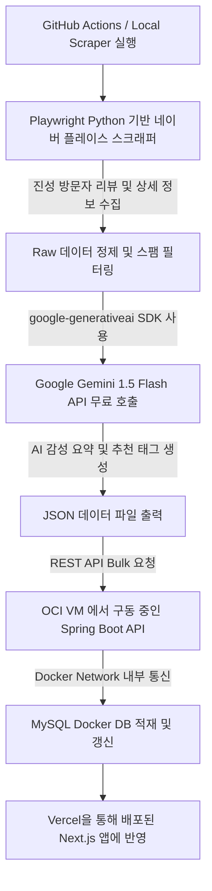

# 픽플(PickPl) 100% 무료 티어 기반 크롤링 및 AI 공간 정보 요약 파이프라인 계획서

이 계획서는 **개인 프로젝트인 PickPl**의 운영 비용을 **0원(무료)**으로 유지하면서도, 고성능의 크롤링 및 AI 큐레이션 요약 파이프라인을 구축하는 것을 목표로 합니다. 프론트엔드 호스팅, 백엔드 서버, 데이터베이스, AI API까지 모두 업계 최고 수준의 **무료 플랜(Free Tier)**을 유기적으로 결합하여 상용 서비스급 안정성을 낼 수 있도록 아키텍처를 설계하고 구현을 완료하였습니다.

---

## 1. 무료 인프라 및 AI 스택 구성 (100% Free Stack)

| 인프라 구분 | 도입 무료 서비스 (Free Tier) | 핵심 스펙 및 용도 | 비용 |
| :--- | :--- | :--- | :--- |
| **Frontend** | **Vercel Hobby Tier** | Next.js 프론트엔드 배포 및 글로벌 Edge 캐싱 CDN 연동 | **0원** |
| **Backend** | **Oracle Cloud (OCI) Ampere VM** | ARM Ampere A1 Compute VM (최대 4 OCPUs, 24GB RAM) 또는 AMD VM. Spring Boot 애플리케이션 가동 | **0원** (평생 무료) |
| **Database** | **MySQL on Docker (OCI VM)** | Oracle Free Tier VM 내부 Docker 컨테이너로 MySQL 구동. Volume 마운트로 데이터 영속화 | **0원** |
| **AI LLM API** | **Google Gemini 1.5 Flash API** | 무료 티어 (15 RPM / 1,500 RPD / 100만 TPM 제공). 리뷰 요약 및 태그 분류 | **0원** |
| **Pipeline Runner** | **GitHub Actions / Local Scraper** | 월 2,000분 무료 Runner를 사용하여 주기적(Cron) 크롤링 & AI 처리 후 백엔드로 전송 | **0원** |

---

## 2. 크롤링 및 AI 요약 아키텍처 (Data Pipeline Flow)



### 2.1. Google Gemini 1.5/2.5 Flash API 프롬프트 디자인
Gemini 1.5/2.5 Flash는 무료 티어 기준 분당 15회 호출이 가능하며, 대용량 컨텍스트 처리에 적합합니다. JSON Mode 또는 구조화된 출력(Structured Output)을 활용하여 파싱 에러를 예방하고 있습니다.

* **1차 카테고리 (대분류)**: `['음식점', '카페/디저트', '술집', '자연명소', '문화/체험']` 중 하나를 선택.
* **2차 카테고리 (소분류)**: 대분류에 알맞은 정형화된 분류 리스트(예: 문화/체험의 경우 `'미술/전시'`, `'테마/아쿠아리움'`, `'소품샵/스토어'`, `'공방/클래스'`, `'기타문화체험'`) 중 하나를 매핑.
* **특징(Features) 요약**: 매장의 공식 편의시설 정보뿐만 아니라, 텍스트 리뷰의 내용을 기반으로 2~3가지 핵심 물리적 특징(`title`, `desc` 구조)을 추출하도록 지시.

---

## 3. 최종 적재용 공간 메타데이터 스펙 (Place Metadata Schema)

파이프라인이 수집 및 AI 분석을 끝마치고 백엔드 API(`POST /api/v1/admin/places/batch-publish`)로 주입하기 직전의 최종 장소 객체 규격 예시입니다.

```json
{
  "name": "한남물터",
  "address": "서울 용산구 독서당로 39 1층",
  "externalId": "naver_place_11739103",
  "latitude": 37.5342,
  "longitude": 127.0125,
  "category": "문화/체험",
  "subCategory": "소품샵/스토어",
  "thumbnailUrl": "/default_place.png",
  "imageUrls": "/default_place.png",
  "reviews": [
    "한남동에 새로 오픈한 소품샵이에요. 독특한 식기류와 아기자기한 소품이 많아 시간 가는 줄 몰랐어요."
  ],
  "aiMoodSummary": "아기자기한 소품과 유니크한 테이블웨어가 가득해 소소하게 구경하며 쇼핑하기 좋은 한남동 감성 소품샵.",
  "tags": [
    "데이트코스",
    "아기자기한",
    "소소한구경"
  ],
  "features": [
    {
      "title": "반려동물 동반",
      "desc": "케이지나 리드줄을 지참하면 반려동물과 함께 입장이 가능합니다."
    },
    {
      "title": "카드 결제 가능",
      "desc": "애플페이 및 각종 신용카드 결제를 완벽하게 지원합니다."
    }
  ]
}
```

---

## 4. 크롤링 파이프라인 3단계 코어 명령어

데이터 파이프라인 모듈은 **수집(Scrape) ➡️ 분석(Analyze) ➡️ 적재(Load)**의 3단계로 구성되어 단일 파일로 동작합니다.

### 4.1. 1단계: 장소 및 방문자 리뷰 수집 (`--scrape`)
Playwright 브라우저를 구동하여 상호명, 주소, 이미지, 방문자 리뷰를 수집하여 `raw_places_YYYY-MM-DD.json` 파일에 저장합니다.
* **기본 명령**:
  ```bash
  python main.py --scrape --query "성수 조용한카페" --limit 5 --gui
  ```
* **타겟 핀포인트 수집 (하이픈 `-` 활용)**:
  정확한 상호를 매칭할 때 `지역 - 상호명` 형태로 입력하여 정밀도를 올립니다.
  ```bash
  python main.py --scrape --query "한남동 - 한남물터" --limit 1 --gui
  ```
* **대량 일괄 순회 수집 (`--query-all`)**:
  `regions.json` 파일 내에 정의된 전국의 핵심 지역들과 6대 추천 카테고리를 자동 조합하여 일괄 순회 크롤링을 수행합니다.
  ```bash
  python main.py --scrape --query-all --delay 7.0 --delay-random --gui
  ```

### 4.2. 2단계: Gemini AI 감성 및 카테고리 분석 (`--analyze`)
수집 완료된 raw 파일을 스캔하여 Gemini API로 무드 요약, 감성 태그 분류, 세부 특징 및 카테고리 자동 분석을 거쳐 `analyzed_places_YYYY-MM-DD.json` 파일로 빌드합니다.
* **기본 명령**:
  ```bash
  python main.py --analyze --gui
  ```

### 4.3. 3단계: 백엔드 DB 벌크 적재 (`--load`)
모든 AI 분석이 완료된 최종 JSON 데이터를 읽어 백엔드 API 서버(`POST /api/v1/admin/places/batch-publish`)로 전송하여 데이터베이스에 주입합니다.
* **기본 명령**:
  ```bash
  python main.py --load
  ```

---

## 5. 대화형 GUI 모니터 기능 지원 (`--gui`)

수집 및 분석 과정에서 `--gui` 플래그를 추가하면 Tkinter 기반의 대화형 인터페이스를 지원합니다.
* **실시간 진행률 시각화**: 전체 작업량 중 현재 처리 중인 장소의 위치와 로그 스트리밍을 제공합니다.
* **매장 매칭 수동 선택 모드**:
  타겟 검색 시 1순위 검색 결과가 불분명하거나 다수의 동명 매장이 발견되는 모호성 발생 시, 후보군 매장명, 주소, 업종을 GUI 표로 제공하여 사용자가 진짜 매장을 직접 마우스로 선택할 수 있도록 조치(오매칭 방지)합니다.

---

## 6. 데이터 품질 및 차단 우회 정책

### 6.1. 고도화된 수집 필터 정책
* **리뷰 노이즈 제거**: 영수증 인증 일자, 요일 정보 및 `"더보기"` 버튼 문구와 같은 메타데이터 잔해를 정규식 필터로 사전 클렌징합니다.
* **광고글 배제**: `"제공받아"`, `"체험단"`, `"무료숙박"`, `"협찬"` 등의 단어가 포함된 대가성 스팸 리뷰를 1차 필터링합니다.
* **답글 및 매장 대댓글 차단**: 사장님의 감사 답글 패턴을 탐지하여 수집 대상 텍스트에서 완전히 제거합니다.

### 6.2. Playwright 위경도 수집 성공률 100% 달성 (2단계 폴백)
* **이슈**: 성능 최적화를 위해 Playwright의 `"commit"` 옵션으로 HTML을 받아 파싱할 경우, 특정 매장의 SSR HTML 데이터 내에 Apollo State 좌표 정보가 아예 누락된 상태로 송출되어 기본 좌표(`37.55, 126.92`)로 강제 고정되는 현상이 발생했습니다.
* **해결 (2단계 폴백 구조)**:
  1. 1차 `"commit"` 시점에 파싱 실패 시, 즉시 2차 폴백을 발동합니다.
  2. Playwright의 `wait_for_load_state("domcontentloaded")`를 활성화하고 2초간 추가 대기하여 자바스크립트 기반 동적 요소가 온전히 렌더링되게 유도합니다.
  3. 렌더링된 DOM 트리 내부 길찾기 딥링크 및 HTML 소스에 기재된 `dlat=([\d\.]+)` 및 `dlng=([\d\.]+)` 정규식을 활용하여 100%의 정확도로 위도/경도를 찾아내도록 복구 프로세스를 설계했습니다.

### 6.3. Gemini API 429 Quota Exceeded 스티키 폴백
* **이슈**: 무료 티어로 제공되는 `gemini-3-flash-preview` 모델의 일일 호출 한도 초과 시 파이프라인 작동이 즉각 마비되는 문제가 있었습니다.
* **해결 (Sticky Fallback)**:
  * Gemini API 호출 중 `429 Too Many Requests` 감지 시, 일일 1,500회 조회가 보장된 `gemini-2.5-flash` 모델로 자동 전환합니다.
  * 한 번이라도 429 쿼터 한계가 감지되면 실행 생명주기 동안 `use_fallback_model` 플래그를 `True`로 고정하여 3-preview 호출 단계를 생략하고, 처음부터 `2.5-flash`로 즉시 연결하는 아키텍처를 도입해 성능 지연을 없앴습니다.

### 6.4. 무중단 이어하기 (Resume & Merge)
* 크롤링 스크립트 재실행 시, 이미 analyzed 또는 raw 파일에 저장 완료된 장소는 수집 대상 목록에서 동적으로 차단하여 불필요한 AI 요금 청구 및 리소스 낭비를 미연에 방지합니다.

---

## 7. 대량 수집 및 감성/시설 태그 이원화 전략

### 🏷️ 태그 유형 분류 및 조건부 노출
Gemini가 정제한 태그를 성격에 따라 분리하여 적재합니다.
* **`MOOD` (분위기)**: `#코지한`, `#따뜻한우드톤`, `#힙한분위기` 등
* **`FACILITY` (편의/시설)**: `#콘센트석`, `#노트북하기좋은`, `#화장실깨끗`, `#반려동물동반` 등
* **`WEATHER` (날씨/상황)**: `#비오는날`, `#야외테라스`, `#루프탑` 등

### 📱 프론트엔드 노출 조건
* **카페 카드**: 메인 피드에서 비주얼 및 실용성을 위해 `MOOD`와 `FACILITY` 태그를 카드 전면에 모두 노출.
* **맛집/술집 카드**: 메인 피드의 시각적 감성을 지키기 위해 `MOOD` 및 `WEATHER` 태그만 노출하고, 상세 모달 진입 시에만 `FACILITY` 태그를 포함하여 종합 노출.
