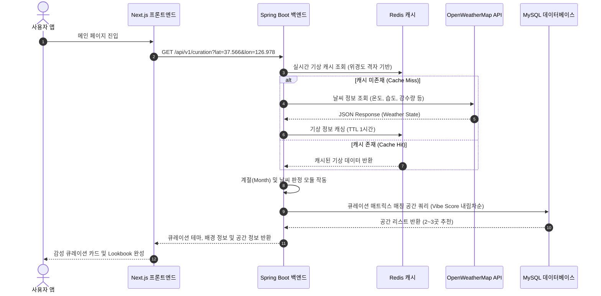
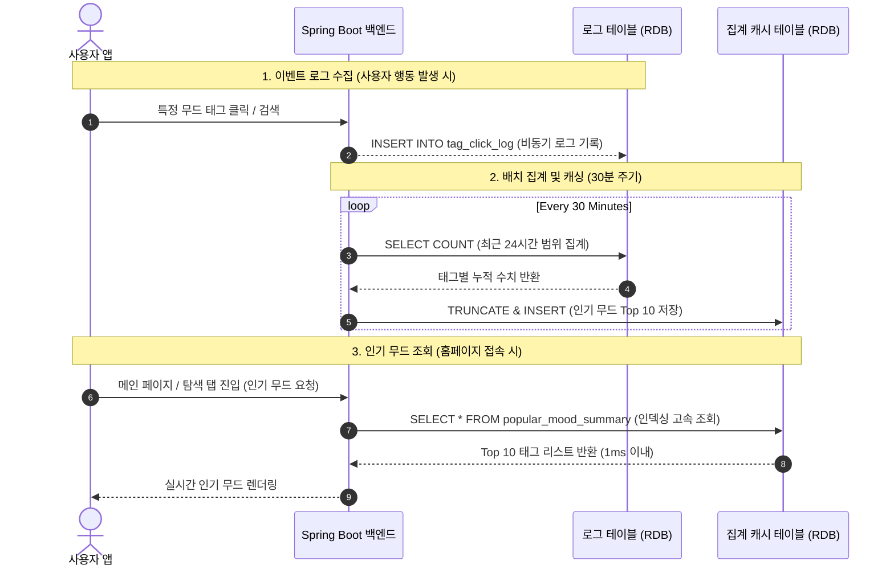

# 🌿 PickPl 차세대 감성 엔진 및 실시간 협업 아키텍처 명세서
> **PickPl Next-Gen Mood Engine & Collaborative Architecture Specification**
>
> 본 명세서는 픽플(PickPl) 플랫폼의 중장기 서비스 확장과 고성능 개인화를 실현하기 위한 **기상 맞춤형 큐레이션 알고리즘**, **유튜브식 하이브리드 추천 엔진**, 그리고 **실시간 공동 Vibe 플래너 세션**의 시스템 아키텍처 및 데이터 흐름을 규정합니다.

---

## 목차
1. [기상 & 계절별 감성 큐레이션 알고리즘 (Weather & Season Curation)](#1-기상--계절별-감성-큐레이션-알고리즘)
2. [유튜브식 개인화 추천 엔진 (Personalized Recommendation Engine)](#2-유튜브식-개인화-추천-엔진)
3. [실시간 공동 Vibe 플래너 세션 아키텍처 (Collaborative Vibe Planner Session)](#3-실시간-공동-vibe-플래너-세션-아키텍처)

---

## 1. 기상 & 계절별 감성 큐레이션 알고리즘

사용자의 현재 위치를 기반으로 실시간 날씨와 계절에 어울리는 감성 공간을 0.1초 만에 큐레이션하여 메인 배너 및 추천 영역에 노출하는 지능형 모듈입니다.

### 1.1 시스템 흐름도 (Data Pipeline Flow)


### 1.2 계절 및 기상 상태 판정 기준 (Curation Matrix)
백엔드는 기상청 단기예보 및 OpenWeatherMap의 날씨 코드를 수신하여 다음과 같이 감성 테마를 자동으로 결정합니다.

| 분류 | 기상 조건 및 판정 범위 | 매칭 감성 태그 | 추천 테마 타이틀 (예시) |
| :--- | :--- | :--- | :--- |
| **초봄 (Chilly Spring)** | 3월 ~ 4월 중순 / 평균 기온 10℃ 이하 | `#우드톤`, `#조용한`, `#따뜻한` | 쌀쌀한 초봄, 온기 가득한 실내에서 나누는 대화 |
| **봄/초여름 (Warm Spring)**| 4월 중순 ~ 5월 / 평균 기온 15℃ ~ 22℃| `#햇살맛집`, `#테라스`, `#플랜테리어` | 봄바람 부는 날, 테라스에서 채광 맛보기 |
| **싱그러운 여름 (Lush Summer)**| 6월 ~ 7월 중순 / 맑고 온화함 | `#플랜테리어`, `#야외테라스`, `#채광좋은` | 싱그러운 초록이 가득한 여름날의 정원 |
| **바캉스 여름 (Summer Vacation)**| 7월 말 ~ 8월 / 평균 기온 28℃ 이상 | `#힙한`, `#루프탑`, `#이색적인` | 일상을 벗어난 휴양지 무드와 이색 오아시스 |
| **가을날 (Crisp Autumn)** | 9월 ~ 11월 / 맑고 쾌적함 | `#조용한`, `#노트북하기좋은`, `#재즈` | 고요하게 가을빛을 느끼며 사색에 잠기기 좋은 곳 |
| **하얀 겨울 (Cozy Winter)** | 12월 ~ 2월 / 평균 기온 0℃ 이하 | `#코지한`, `#아늑한`, `#따뜻한 분위기` | 추위를 녹여줄 포근한 벽난로 감성의 아지트 |
| **비 오는 날 (Rainy Vibe)** | 사계절 공통 / 강수 감지 시 최우선순위| `#비오는날`, `#창가자리`, `#조용한` | 통창 너머 흐르는 빗방울을 보며 머무는 시간 |

### 1.3 큐레이션 랭킹 스코어 모델 (Curation Rank Scoring)
특정 큐레이션 테마에 속하는 공간의 노출 우선순위는 아래 스코어링 공식에 의해 계산됩니다.
$$Score = W_s \cdot (SeasonMatch) + W_w \cdot (WeatherMatch) + W_p \cdot (VibeScore)$$

- **$SeasonMatch$**: 해당 공간이 가진 태그와 현재 계절 가중치 매칭률 (0.0 ~ 1.0)
- **$WeatherMatch$**: 해당 공간이 가진 태그와 현재 기상 가중치 매칭률 (0.0 ~ 1.0)
- **$VibeScore$**: 플랫폼 내 사용자들이 투표한 해당 공간의 신뢰 무드 기여율 (예: 대화하기 좋은 분위기가 65% 이상일 때 가중치 부여)
- **가중치 정의**: $W_s = 0.35, W_w = 0.45, W_p = 0.20$

### 1.4 실시간 기상/계절 큐레이션 구현 및 연동 계획

내일(2026-06-23) 작업에 바로 착수할 수 있도록 상세 연동 설계와 스펙을 기술합니다.

#### A. 백엔드 패키지 및 클래스 설계
* **`WeatherClient.java` (날씨 API 연동)**:
  * 별도의 API 키 발급이 필요 없는 **Open-Meteo API**(`https://api.open-meteo.com/v1/forecast`)를 활용해 실시간 기상을 조회합니다.
  * **위경도 고정**: 개인화된 GPS 기반 큐레이션이 아닌 모든 유저에게 공통된 감성을 제공하기 위해, 백엔드 서버에서 특정 기준 위치 **(네이버 본사: 37.3595704, 127.105399 또는 서울역)**의 위경도로 고정하여 단일 날씨 정보를 조회합니다.
  * API 호출 실패/타임아웃 시 서비스 중단을 방지하기 위해 기본값 `CLEAR(맑음)` 상태로 안전하게 폴백(Fallback) 처리합니다.
* **`CurationService.java` (판정 및 추천 비즈니스 로직)**:
  * 기상 상태(`RAINY`, `SNOWY`, `CLEAR`) 및 현재 월(Month)에 근거해 메인 큐레이션 테마를 실시간 결정합니다.
  * **판정 매트릭스**:
    * **비 오는 날 (최우선순위)**: WMO 날씨 코드가 강수 감지 시 최우선 노출. (매칭 태그: `#비오는날` / 타이틀: `🌧️ 비 오는 날, 창밖을 보기 좋은 카페`)
    * **여름철 (6월~8월)**: (매칭 태그: `#여름휴가` / 타이틀: `🌊 무더위를 식혀줄 푸른 오아시스, 여름 바캉스 추천`)
    * **가을철 (9월~11월)**: (매칭 태그: `#단풍구경` / 타이틀: `🍁 가을 단풍과 함께 감성이 무르익는 산책 명소`)
    * **겨울철 (12월~2월)**: (매칭 태그: `#코지한` / 타이틀: `❄️ 추위를 녹여줄 포근한 감성의 아지트`)
    * **봄철 (3월~5월)**: (매칭 태그: `#햇살맛집` / 타이틀: `🌱 싱그러운 봄 햇살을 온전히 만끽하기 좋은 공간`)
  * 액티브 태그로 `PlaceRepository.findPlacesMatchingAllTags(List.of(tagName), 1)` 쿼리를 호출해 해당 테마 공간 목록을 조회합니다.
* **`CurationController.java` (API 엔드포인트)**:
  * 엔드포인트: `GET /api/v1/curation` (별도의 위경도 파라미터는 전달받지 않고 서버 고정 위치 기준으로 날씨 조회)
  * 반환 구조: `activeThemeTitle`, `activeThemeName`, `places` 목록 DTO

#### B. 프론트엔드 연동 및 큐레이션 UX 설계
* **동적 배너 연동**:
  * 발견(Discover) 탭 메인 배너 및 우측 PC 배너의 타이틀을 백엔드 실시간 응답인 `activeThemeTitle`로 렌더링합니다.
* **큐레이션 활성화 모드**:
  * 큐레이션 배너 클릭 시 `isCurationActive = true` 필터 상태를 켭니다.
  * 피드 카드 리스트 상단에 `[ 🌧️ 비 오는 날 큐레이션 활성화 중 ✕ ]` 같은 활성화 칩을 띄우고, ✕ 클릭 시 필터를 꺼서 원래의 전체 룩북 피드로 돌려놓습니다.
  * 사용자 GPS 갱신 및 위치 여부와 무관하게 전역적으로 고정된 날씨 테마를 똑같이 경험합니다.

---

## 2. 유튜브식 개인화 추천 엔진

단순한 무드 태그 분류를 넘어, 사용자의 누적 활동 로그(Implicit Feedback)를 분석하여 사용자가 좋아할 가능성이 가장 높은 공간들을 메인 탭 피드에 실시간 개인화 배치하는 인공지능 추천 아키텍처입니다.

### 2.1 하이브리드 추천 모델 아키텍처
추천 엔진은 **콘텐츠 기반 필터링(Content-Based Filtering)**과 **협업 필터링(Collaborative Filtering)**의 강점을 결합한 하이브리드(Hybrid) 방식을 채택합니다.

```
                  [ 사용자 활동 로그 ]
             (조회, 스크랩, 분위기 투표, 리뷰)
                          │
         ┌────────────────┴────────────────┐
         ▼                                 ▼
[ 협업 필터링 (CF) ]             [ 콘텐츠 기반 필터링 (CBF) ]
- 유사한 취향의 사용자들이       - 사용자의 개인 무드 프로필 벡터와
  찜한 공간 후보군 추출           공간별 AI 요약 무드 벡터의 유사도 계산
(Matrix Factorization / ALS)     (TF-IDF & Cosine Similarity)
         │                                 │
         └────────────────┬────────────────┘
                          ▼
            [ 랭킹 및 필터링 레이어 ]
            - 인기 지수(Popularity Rank) 결합
            - 이미 방문 기록을 남긴 공간 필터링
                          │
                          ▼
              [ 개인화된 공간 추천 피드 ]
```

### 2.2 수학적 데이터 모델링 및 알고리즘

#### A. 사용자 무드 프로필 벡터 (User Mood Profile Vector)
사용자 $u$가 플랫폼 내에서 소비한 공간 $p$들의 무드 태그 가중치를 통해 사용자 무드 프로필 벡터 $\vec{U}_u$를 구축합니다.
$$\vec{U}_u = \sum_{p \in P_u} \alpha(u, p) \cdot \vec{V}_p$$
- **$P_u$**: 사용자 $u$가 피드백을 보낸 전체 공간 세트
- **$\vec{V}_p$**: 공간 $p$의 무드 태그 벡터 (TF-IDF 방식으로 계산된 가중치 벡터)
- **$\alpha(u, p)$**: 사용자 행동 방식에 따른 감성 강도 가중치:
  - 공간 단순 상세 보기: $+1$
  - 분위기 투표 참여: $+2$
  - 나만의 폴더에 스크랩(저장): $+4$
  - 긍정적 리뷰 및 코멘트 작성: $+5$

#### B. 콘텐츠 유사도 매칭 (Cosine Similarity)
사용자 무드 프로필 $\vec{U}_u$와 임의의 공간 $p$의 무드 벡터 $\vec{V}_p$ 간의 코사인 유사도를 통해 매칭 지수를 산출합니다.
$$Sim(u, p) = \frac{\vec{U}_u \cdot \vec{V}_p}{\|\vec{U}_u\| \|\vec{V}_p\|}$$

#### C. 최신 인기 보정 지수 (Time-Decayed Popularity Score)
오래된 인기 장소에 편중되는 현상을 방지하기 위해, 조회수 및 리뷰수에 시간 감쇄 함수(Exponential Time Decay)를 적용하여 추천 점수를 보정합니다.
$$PopScore(p) = \left( \frac{Views_p + 2 \cdot Scraps_p}{1} \right) \cdot e^{-\lambda(t_{current} - t_{created})}$$
- **$\lambda$**: 시간 경과에 따른 감쇄 계수
- **$t_{current} - t_{created}$**: 공간 등록 이후 경과된 일수(days)

### 2.3 추천 API 설계 (Endpoint Specification)

#### [GET] /api/v1/places/recommendations
사용자 식별 토큰(Bearer JWT)을 감지하여 고도화된 개인화 공간 리스트를 반환합니다. 비로그인 세션일 경우 시스템 인기 보정 지수가 높은 순으로 디폴트 정렬하여 반환합니다.

- **Request Headers**:
  ```http
  Authorization: Bearer <JWT_ACCESS_TOKEN>
  ```
- **Response JSON (200 OK)**:
  ```json
  {
    "status": "SUCCESS",
    "data": {
      "recommendationType": "PERSONALIZED_HYBRID",
      "userPrimaryMood": "햇살맛집",
      "recommendedPlaces": [
        {
          "placeId": 4,
          "name": "어반플랜트 합정",
          "matchRatio": 94,
          "reason": "최근 솜님이 스크랩한 '오프에어 망원'과 같이 햇살 가득한 플랜테리어 무드를 즐겨 찾으시는 분께 추천해요.",
          "address": "서울 마포구 독막로 12",
          "category": "브런치",
          "thumbnailUrl": "https://images.unsplash.com/photo-1497935586351-b67a49e012bf"
        }
      ]
    }
  }
  ```

---

## 3. 실시간 공동 Vibe 플래너 세션 아키텍처

여러 명의 사용자가 하나의 플랜 세션(방)을 공유하며, 픽플에서 탐색한 공간들을 공동 위시리스트에 담고, 실시간으로 투표 및 피드백을 주고받아 여정을 완성해 가는 협업 모듈입니다.

### 3.1 시스템 아키텍처 (STOMP Web Socket Integration)
실시간 양방향 데이터 싱크를 보장하며 다중 서버 환경에서도 안정적으로 세션을 관리하기 위한 시스템 구성도입니다.

```
       [ Client A ]                [ Client B ]
            │                           │
  HTTP      │ WebSocket/STOMP           │ HTTP
 (REST API) │ (실시간 투표/동기화)       │ (REST API)
            ▼                           ▼
┌──────────────────────────────────────────────┐
│             Next.js Frontend                 │
└──────────────────────────────────────────────┘
                    │  ▲ (STOMP Broker Channel)
                    ▼  │
┌──────────────────────────────────────────────┐
│           Spring Boot Application            │
│   ┌──────────────────────────────────────┐   │
│   │   WebSocketMessageBrokerConfig       │   │
│   └──────────────────────────────────────┘   │
└──────────────────────────────────────────────┘
       │                                 │
       ▼                                 ▼
┌──────────────────┐             ┌──────────────┐
│   Redis Server   │             │  MySQL DB    │
│ - Live Session   │             │ - 플랜 세션  │
│   Lobby State    │             │   영속 데이터│
│ - Pub/Sub Broker │             │ - 최종 루트  │
└──────────────────┘             └──────────────┘
```

### 3.2 실시간 세션 데이터 모델 (MySQL & Redis Schema)

#### MySQL - `vibe_planner_session` (물리 스키마)
플래너 세션의 기본 마스터 정보와 영속 데이터를 저장합니다.
```sql
CREATE TABLE vibe_planner_session (
    id BIGINT AUTO_INCREMENT PRIMARY KEY,
    room_code VARCHAR(10) NOT NULL UNIQUE,  -- 'PKPL-948A' 같은 초대 코드
    title VARCHAR(100) NOT NULL,            -- 세션 제목
    host_id BIGINT NOT NULL,                -- 방장 ID
    created_at TIMESTAMP DEFAULT CURRENT_TIMESTAMP
);
```

#### Redis - `session:lobby:{room_code}` (메모리 구조)
가장 빈번하게 변경되는 실시간 로비 내 접속자 현황 및 추가된 공간 리스트, 사용자별 찬/반 투표 상태(Voting State)를 고속 관리하기 위한 해시 구조입니다.
```json
{
  "roomCode": "PKPL-948A",
  "activeMembers": [
    {"userId": 1, "nickname": "솜이 (호스트)", "avatar": "cat_profile"},
    {"userId": 2, "nickname": "지우", "avatar": "fox_profile"},
    {"userId": 3, "nickname": "민우", "avatar": "bear_profile"}
  ],
  "wishlist": [
    {
      "placeId": 4,
      "placeName": "어반플랜트 합정",
      "addedBy": "솜이",
      "votes": {
        "userId_1": "UP",
        "userId_2": "UP",
        "userId_3": "DOWN"
      },
      "upCount": 2,
      "downCount": 1
    }
  ]
}
```

### 3.3 STOMP 실시간 메시징 프로토콜 규격
프론트엔드와 백엔드가 소켓 연결을 확립한 후 주고받는 메시지 프로토콜 규격입니다.

#### A. 세션 채널 구독 (Subscribe Path)
- **로비 실시간 업데이트 수신 구독 채널**: `/topic/planner/{roomCode}`
- **개별 사용자 실시간 알림 수신 구독 채널**: `/queue/planner/{userId}`

#### B. 공간 추가 이벤트 송신 (Send Path)
공간 상세 탐색 화면에서 "플래너에 추가"를 터치했을 때 발행되는 액션 메시지 프레임입니다.
- **Destination**: `/app/planner/{roomCode}/add-place`
- **Payload**:
  ```json
  {
    "userId": 1,
    "nickname": "솜이",
    "placeId": 4,
    "placeName": "어반플랜트 합정",
    "thumbnailUrl": "https://images.unsplash.com/photo-1497935586351-b67a49e012bf"
  }
  ```

#### C. 실시간 공간 투표 이벤트 송신 (Send Path)
세션에 참가 중인 사용자가 해당 공간에 대해 투표를 행사했을 때 발행되는 액션 메시지 프레임입니다.
- **Destination**: `/app/planner/{roomCode}/vote-place`
- **Payload**:
  ```json
  {
    "userId": 2,
    "placeId": 4,
    "voteType": "UP" // 'UP' (좋아요 👍) 또는 'DOWN' (글쎄 🤔)
  }
  ```

#### D. 브로드캐스팅 로비 갱신 응답 (Broadcast Payload)
이벤트 수신 시 백엔드는 계산된 새로운 로비 구조를 실시간 채널(`/topic/planner/{roomCode}`)에 구독 중인 모든 클라이언트에게 즉시 전송합니다.
```json
{
  "eventType": "PLACE_VOTED",
  "targetPlaceId": 4,
  "votedBy": "지우",
  "voteType": "UP",
  "updatedWishlist": [
    {
      "placeId": 4,
      "upCount": 3,
      "downCount": 0,
      "vibeStatus": "PERFECT_MATCH"
    }
  ]
}
```

---

## 4. 실시간 인기 무드 집계 및 캐싱 아키텍처 (Real-time Popular Moods)

사용자들의 실시간 공간 관심도 및 검색 트렌드를 분석하여 메인 페이지와 공간 탐색 탭에 '실시간 인기 무드(태그)' 순위를 제공합니다. 대용량 트래픽 상황에서도 데이터베이스 부하를 최소화하기 위해 **슬라이딩 윈도우 기반 배치 캐싱(Batch Caching) 아키텍처**를 사용합니다.

### 4.1 시스템 아키텍처 흐름 (Data Flow)

사용자가 페이지를 조회할 때마다 매번 수만 건의 로그 데이터를 직접 집계(`GROUP BY`)하지 않고, 백엔드 스케줄러가 주기적으로 집계해 둔 요약본을 캐싱 조회하는 구조입니다.



### 4.2 데이터베이스 스키마 설계

#### A. tag_click_log (사용자 이벤트 로그 테이블 - 무제한 적재)
사용자의 실시간 행동 패턴을 로깅하는 물리 테이블입니다. (추후 데이터 분석을 위해 파티셔닝 적용 가능)
```sql
CREATE TABLE tag_click_log (
    log_id BIGINT AUTO_INCREMENT PRIMARY KEY,
    user_id BIGINT NULL,               -- 비로그인 유저인 경우 NULL 허용
    tag_name VARCHAR(50) NOT NULL,     -- 클릭된 태그명 (예: '코지한')
    created_at TIMESTAMP DEFAULT CURRENT_TIMESTAMP,
    INDEX idx_created_at (created_at)  -- 배치 쿼리 속도 향상을 위한 인덱스
);
```

#### B. popular_mood_summary (집계 캐시 테이블 - 최대 10~20행)
홈페이지 접속 시 조회되는 고속 읽기 전용 테이블입니다.
```sql
CREATE TABLE popular_mood_summary (
    ranking INT PRIMARY KEY,           -- 1위부터 10위까지 순위 (1~10)
    tag_name VARCHAR(50) NOT NULL,     -- 태그명
    score INT NOT NULL,                -- 가중치 점수 또는 클릭 횟수
    updated_at TIMESTAMP DEFAULT CURRENT_TIMESTAMP ON UPDATE CURRENT_TIMESTAMP
);
```

### 4.3 배치 집계 알고리즘 (Spring Boot Scheduler)

스케줄러는 30분 단위로 최근 24시간 동안 축적된 로그를 스캔하여 결과를 교체(TRUNCATE & INSERT) 처리합니다.
```java
@Scheduled(cron = "0 0/30 * * * *") // 30분 간격 실행
@Transactional
public void refreshPopularMoods() {
    // 1. 최근 24시간 동안의 클릭 횟수 집계
    List<PopularMoodDto> topMoods = tagClickLogRepository.findTop10MoodsInLast24Hours();

    // 2. 캐시 테이블 갱신
    popularMoodSummaryRepository.truncateTable();
    for (int i = 0; i < topMoods.size(); i++) {
        popularMoodSummaryRepository.save(new PopularMoodSummary(
            i + 1, // ranking
            topMoods.get(i).getTagName(),
            topMoods.get(i).getClickCount()
        ));
    }
}
```

---

## 5. 결론 및 향후 로드맵

본 명세서는 픽플의 프리미엄 감성 정체성을 기술적으로 뒷받침하는 핵심 근간이 될 것입니다. 
1. **1단계**: 본 설계에 기반한 데이터 바인딩 스키마를 MySQL에 반영.
2. **2단계**: Spring Boot WebSocket 설정 및 STOMP 메시지 브로커 통합.
3. **3단계**: 외부 기상 정보 연계 크론잡 개발 및 사용자 무드 프로파일링 TF-IDF 유사도 모델 구현.
4. **4단계**: 시간 감쇠를 반영한 인기 무드 스케줄러 및 배치 캐싱 기능 개발.

