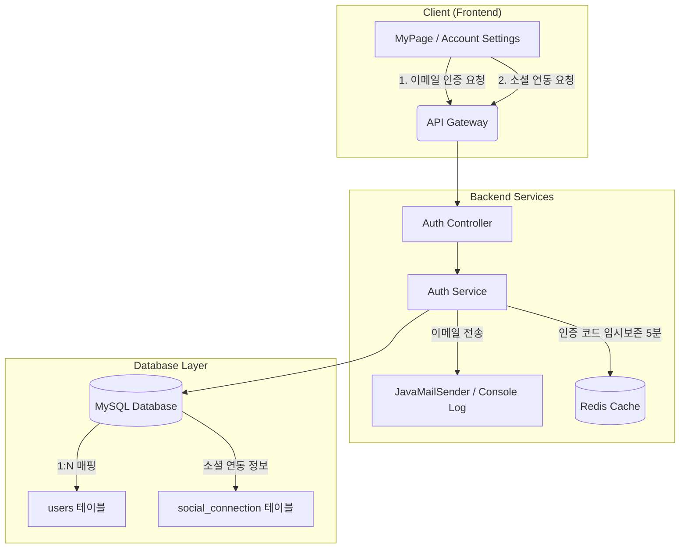
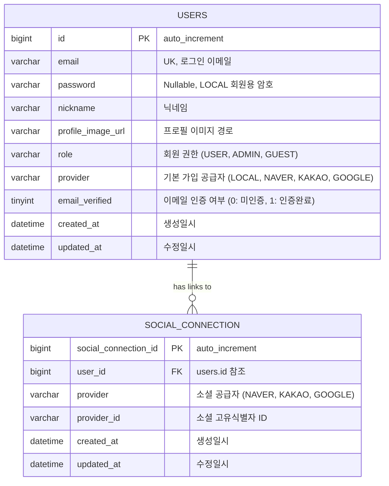
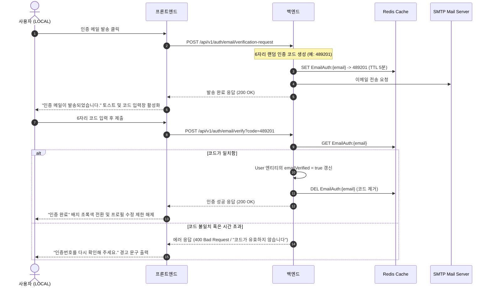
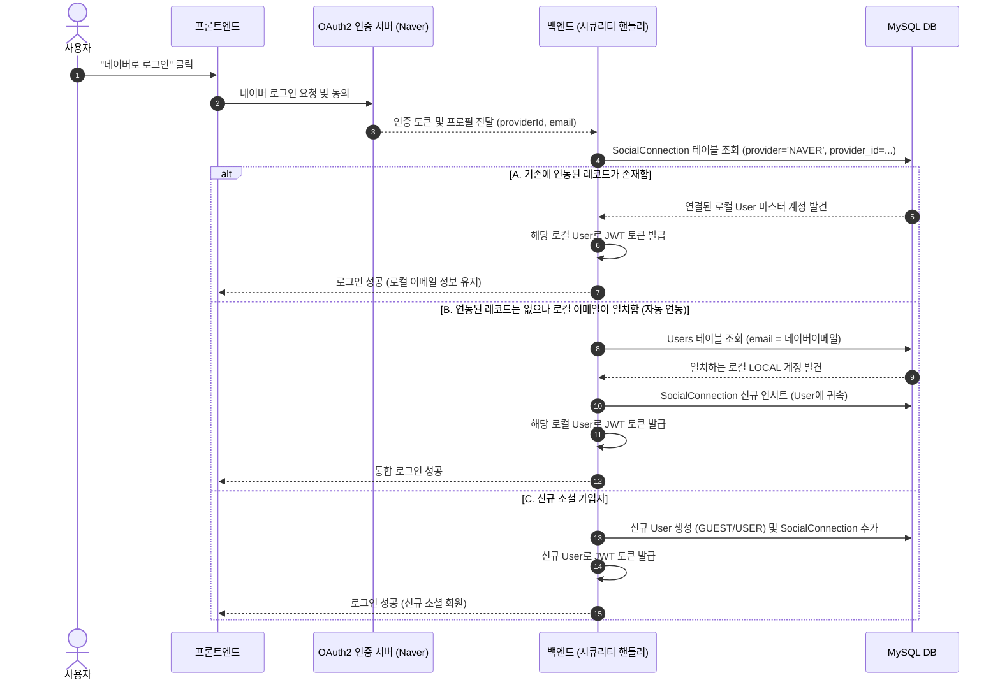

# 회원 이메일 인증 및 소셜 통합 계정 설계 명세서 (User Verification & Account Integration Spec)

본 문서는 **픽플(PickPl)** 플랫폼의 사용자 이메일 소유권 인증 시스템 및 소셜(네이버, 카카오, 구글) 통합 계정 연동 아키텍처에 대한 데이터베이스 및 서비스 설계 명세입니다.

---

## 1. 아키텍처 개요 (Overview)

통합 계정 시스템은 로컬 이메일 가입 계정(`LOCAL`)을 중심으로 다양한 소셜 공급자(OAuth2) 계정을 자유롭게 매핑하여 하나의 **마스터 계정**으로 통합 로그인할 수 있는 구조를 제공합니다. 또한, 실사용자 검증을 위해 로컬 계정은 이메일 인증 절차를 거치며, 미인증 유저에게는 프로필 설정 제한과 같은 적절한 패널티와 유도 배너를 제공합니다.



---

## 2. 데이터베이스 스키마 설계 (Database Schema Design)

기존 단일 매핑 구조(유저 1명당 1개의 소셜 정보 소유)를 다중 연동 구조로 개편하기 위해 `social_connection` 테이블을 추가하고, 이메일 인증 관리를 위해 `users` 테이블에 인증 컬럼을 증설합니다.

### 2.1 ER 다이어그램 (ERD)



### 2.2 테이블 명세 (Table Specifications)

#### 1) `users` 테이블 변경 사항
| 컬럼명 | 타입 | Nullable | 기본값 | 설명 |
| :--- | :--- | :---: | :---: | :--- |
| **email_verified** | `tinyint(1)` | NO | `0` | 이메일 인증 여부 (0: false, 1: true) |

#### 2) `social_connection` 테이블 신규 생성
| 컬럼명 | 타입 | Nullable | 제약조건 | 설명 |
| :--- | :--- | :---: | :---: | :--- |
| **social_connection_id** | `bigint` | NO | PK, Auto Increment | 소셜 연동 고유 식별값 |
| **user_id** | `bigint` | NO | FK (users.id) | 연결된 마스터 로컬 유저 ID |
| **provider** | `varchar(50)` | NO | | 소셜 공급자 명 (NAVER, KAKAO, GOOGLE) |
| **provider_id** | `varchar(255)` | NO | | 소셜 API에서 제공하는 고유 회원번호 |

> [!NOTE]
> **중복 연동 방지 제약조건 (Unique Constraint)**
> `social_connection` 테이블에는 `(provider, provider_id)` 복합 유니크 인덱스를 지정하여 특정 소셜 계정이 여러 로컬 유저 계정에 이중으로 연결되는 것을 데이터베이스 레벨에서 원천 차단합니다.

### 2.3 스크립트 DDL (SQL Script)

JPA를 통해 자동 갱신되지 않는 환경을 위해 수동 마이그레이션 DDL 쿼리는 다음과 같습니다.

```sql
-- 1. users 테이블에 이메일 인증 컬럼 추가
ALTER TABLE `users` 
ADD COLUMN `email_verified` TINYINT(1) NOT NULL DEFAULT 0 COMMENT '이메일 인증 여부';

-- 2. social_connection 테이블 신규 생성
CREATE TABLE `social_connection` (
    `social_connection_id` BIGINT NOT NULL AUTO_INCREMENT,
    `user_id` BIGINT NOT NULL COMMENT '마스터 계정 ID',
    `provider` VARCHAR(50) NOT NULL COMMENT '소셜 공급자 (NAVER, KAKAO, GOOGLE)',
    `provider_id` VARCHAR(255) NOT NULL COMMENT '소셜 고유 회원식별자',
    `created_at` DATETIME NOT NULL DEFAULT CURRENT_TIMESTAMP,
    `updated_at` DATETIME NOT NULL DEFAULT CURRENT_TIMESTAMP ON UPDATE CURRENT_TIMESTAMP,
    PRIMARY KEY (`social_connection_id`),
    CONSTRAINT `fk_social_conn_user` FOREIGN KEY (`user_id`) REFERENCES `users` (`id`) ON DELETE CASCADE,
    UNIQUE KEY `uk_provider_and_id` (`provider`, `provider_id`)
) ENGINE=InnoDB DEFAULT CHARSET=utf8mb4 COLLATE=utf8mb4_unicode_ci COMMENT='소셜 연동 계정 정보';
```

---

## 3. 이메일 인증 시스템 설계 (Email Verification)

### 3.1 이메일 인증 처리 플로우


### 3.2 정책 및 제약 사항
* **미인증 LOCAL 계정 패널티**:
  * 마이페이지 접속 시 화면 상단에 경고 메시지 띠("[!] 이메일 인증을 완료하셔야 정상적인 활동이 가능합니다.") 노출.
  * "프로필 수정" 클릭 차단: 클릭 시 모달이 뜨지 않고 경고 팝업이 노출되며 설정 탭으로 포커스가 강제 스위칭됩니다.
* **소셜 계정의 우대 정책**:
  * 구글, 네이버, 카카오 등 외부 소셜 가입자는 신뢰도가 보장된 소셜 서버에서 이미 메일 인증이 통과된 계정이므로, 회원 가입 시점에 자동으로 `email_verified = 1 (true)` 처리하여 불필요한 장벽을 해소합니다.

---

## 4. 소셜 통합 계정 연동 설계 (Unified Integration)

### 4.1 로그인 성공 시 계정 통합 플로우
사용자가 로그아웃된 상태에서 **"네이버로 로그인"**을 시도했을 때, 내부적으로 기존 로컬 회원 계정과 통합되어 로그인되는 흐름입니다.



### 4.2 설정창 소셜 플랫폼 브랜딩 배지 디자인
유저가 소셜 다중 연동에 성공했을 때, 네이티브 앱 같은 친화적인 배지 색상을 입혀 시각적 밸런스를 향상시킵니다.

* **네이버 (Naver Green)**
  * 연동 완료 배지 색상: 연두/초록 톤 (`#03C75A` 네추럴 네이버 브랜드 컬러)
  * CSS 스타일: `bg-[#03C75A]/10 text-[#03C75A] border-[#03C75A]/30`
* **카카오 (Kakao Yellow)**
  * 연동 완료 배지 색상: 노랑/브라운 톤 (`#FEE500` 브랜드 컬러)
  * CSS 스타일: `bg-[#FEE500]/20 text-[#3C1E1E] border-[#FEE500]/50`
* **구글 (Google Grey)**
  * 연동 완료 배지 색상: 깔끔한 모던 실버 그레이 톤 (`#4E5968` 컬러)
  * CSS 스타일: `bg-[#F2F4F6] text-[#4E5968] border-[#E5E8EB]`

---

## 5. 구현 완료 결과 (Implementation Results)

본 설계 명세서에 기반하여 회원 이메일 인증 및 소셜 통합 계정 연동 시스템을 성공적으로 구현 완료하였습니다. 실제 구현에 따른 주요 특징과 기술적 명세는 다음과 같습니다.

### 5.1 데이터베이스 ERD 반영 상태
* `users` 테이블에 `email_verified` (tinyint(1)) 컬럼이 정상적으로 추가되었습니다.
* `social_connection` 테이블이 신규 생성되어 `users` 테이블과 `1:N` 관계로 연동되었습니다.
* `(provider, provider_id)` 복합 유니크 제약조건(Unique Key)을 통해 하나의 소셜 계정이 여러 마스터 계정에 중복 연동되는 것을 방지합니다.

### 5.2 백엔드 구현 및 라이브러리 추가
* **의존성 추가**: 
  - 백엔드 `build.gradle`에 `spring-boot-starter-mail` 라이브러리를 추가하여 SMTP 메일 발송 기반을 마련했습니다.
* **환경 변수 구성**:
  - `application.yml`에 `${MAIL_HOST}`, `${MAIL_PORT}`, `${MAIL_USERNAME}`, `${MAIL_PASSWORD}` 속성을 주입하여 구글 SMTP 서버 등 다양한 SMTP 포털을 사용할 수 있도록 설계했습니다.
  - 보안을 위해 외부 `.env` 파일에 SMTP 관련 접속 계정 및 소문자 16자리 지메일 앱 비밀번호를 기입하여 런타임에 동적으로 주입합니다.
* **이메일 발송 비즈니스 로직 (`AuthService.java`)**:
  - `sendVerificationEmail` 메소드를 통해 6자리 난수 코드를 발송합니다.
  - 동시에 Redis 캐시에 `EmailAuth:{email}` 키로 생성된 코드를 5분 만료(`TTL 5분`) 상태로 캐싱합니다.
  - 메일 템플릿은 픽플 브랜드 컬러(피치/주황톤 🍊)에 맞춘 프리미엄 HTML을 적용했으며, `pickpl_main_logo.png` 로고를 CID(Content-ID)를 통한 인라인 리소스 이미지(`cid:logo`)로 첨부하여 렌더링 완성도를 극대화했습니다.
  - **SMTP 예외 가드 (Fallback)**: 개발/로컬 환경에서 SMTP 세팅이 불안정하거나 누락되더라도 서버 전체가 `500 Internal Server Error`를 발생시키지 않고, 콘솔 로그에 인증코드를 프린트하여 정상적으로 프론트엔드 테스트가 가능하도록 예외 가드를 구축했습니다.

### 5.3 프론트엔드 구현 및 스마트 UI
* **전체 화면 덮음 오버레이 모달창**:
  - 사용자 경험을 향상시키기 위해 이메일 본인 인증 및 입력 폼을 **모달창(Modal Overlay)** 형태로 구현했습니다.
  - **React Portal (`createPortal`)**을 도입하여 모달을 `document.body` 최상단에 마운트함으로써, 사이드바 등 상위 레이아웃의 쌓임 맥락(Stacking Context)이나 z-index 영향을 차단하고 전체 화면을 온전히 덮으며 블러(`backdrop-blur-sm`)와 어두운 딤드 처리를 제공합니다.
* **6칸 분할 스마트 입력 폼**:
  - 6자리의 인증 코드를 입력받는 6개의 개별 input 박스로 구성되어 있습니다.
  - **Auto-focus & Backspace**: 값을 입력하면 다음 칸으로 자동으로 포커스가 넘어가고, 백스페이스를 누르면 이전 칸의 값을 지우며 포커스가 자동으로 역전이되는 스마트 UX가 내장되어 있습니다.
  - **Ctrl+V 붙여넣기 파싱**: 사용자가 이메일에서 6자리 코드를 한 번에 복사하여 첫 번째 칸에 붙여넣으면, Clipboard 이벤트를 감지하여 자동으로 6개 input에 한 글자씩 나누어 주입합니다.
* **지속형 카운트다운 타이머**:
  - 메일 발송 성공 시 `localStorage`에 5분 만료 타임스탬프(`pickpl_verify_expiry`)를 영구 저장합니다.
  - 모달창을 닫았다가 다시 열어도, 혹은 다른 페이지로 이동했다가 재진입해도 타이머 상태를 자동으로 감지하여 남은 잔여 초를 이어서 카운트다운합니다.
  - 메인 카드 화면에는 `⏱️ 인증 진행 중 (남은 시간: X:XX) / 인증 코드 입력하기` 버튼을 노출하여 사용자가 언제든 인증 플로우에 재진입할 수 있도록 유도합니다.
* **인증번호 다시 보내기**:
  - 모달 내부 및 메인 카드에서 인증번호 재요청 시 기존 타이머 및 입력 필드들이 초기화되면서, API를 재호출하여 새 메일을 받아볼 수 있는 완전한 재전송 라이프사이클을 제공합니다.

